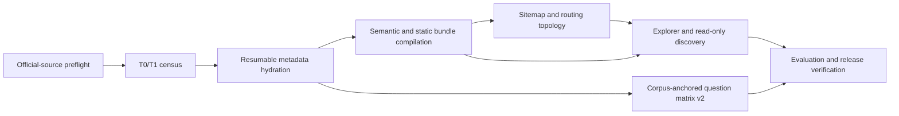
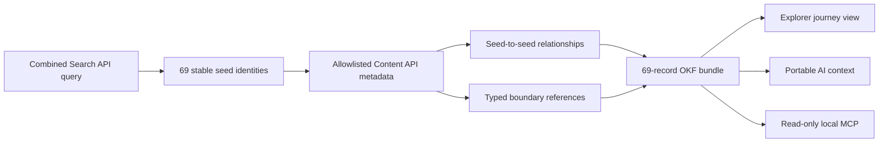

# Architecture and operating workflow

This repository publishes a derived, non-authoritative metadata catalogue. It
does not mirror GOV.UK page bodies and it does not treat one public interface as
an authoritative bulk inventory.

## Data and control flow



The control plane is the repository, semantic profile, Explorer shell,
descriptors, manifests, status documents and checksums. At release packaging,
the immutable gzip record, search, route, relationship-adjacency and semantic
shards become deterministic, same-origin GitHub Pages `.pack.gz` byte-range
resources. The offset index preserves every virtual shard path and binds both
the transport member and recovered source bytes. Identical packs are mirrored
as immutable GitHub Release assets for offline use; browser code never fetches
the cross-origin Release URLs. External data-plane hosting is not authorised,
and a 950,000,000-byte Pages capacity failure blocks publication rather than
narrowing the corpus. See
[`ADR-005`](../governance/decisions/ADR-005-github-pages-range-pack-data-plane.md).

## Source boundary and identities

The denominator is a dated union of public official observations: sitemap
shards, partitioned Search API results, Organisations API records, curated
navigation roots and typed links reached during Content API hydration. Search
and sitemap limitations remain explicit in
`research/source-constraints.json`.

Canonicalisation preserves content identity, locale document, observable
edition, route, resource, navigation node and organisation distinctions.
Relationships are evidence-bearing assertions with a source URL, locator,
retrieval time, derivation, software version, confidence and snapshot.

Complete bodies are neither release inputs nor outputs. The hydrator retains a
bounded, allowlisted source-native metadata envelope. Attachment metadata and
canonical links may be published; attachment bodies and third-party material
are not copied. Structured link extraction may inspect an allowed response
transiently, but body text is not retained.

### Bounded demonstrator branch

`ADR-008` defines a separate review milestone for the new-child journey. It
does not change the full Release 1 denominator above. One combined Search API
query supplies exactly 69 deduplicated seeds from three mainstream browse
paths; each seed is hydrated from the Content API, while typed targets outside
the seed set remain boundary references. The immutable acquisition is bounded
to 250 retained metadata records and 500 official-source attempts.



The frozen snapshot can be checked or rebuilt without network access:

```sh
python3 scripts/acquire_new_child_demo.py check demo/snapshots/NEW-CHILD-20260715
python3 scripts/build_bundle.py --check
```

The demonstrator has its own exact 69/69 completeness claim. It must never be
described as complete GOV.UK coverage or used alone to determine entitlement.

## 1. Preflight and census

Validate the frozen audit offline before a network run:

```sh
python3 scripts/preflight_sources.py --check
```

A full census uses the safe defaults: opposing Search API passes and a second
byte-stability pass over the complete sitemap. Development flags such as
`--single-search-pass`, `--no-sitemap-stability-pass`, `--search-limit`,
`--sitemap-shard-limit` and `--navigation-limit` produce sampled evidence that
cannot pass the release gate.

```sh
python3 scripts/acquire_corpus.py T0-YYYYMMDD
```

The census is resumable under `corpus/cache/<label>/` and writes:

- `corpus/source-manifests/<label>/manifest.json`;
- `corpus/inventory/<label>-candidates.jsonl.gz`;
- `corpus/inventory/<label>-source-records.jsonl.gz`;
- `corpus/reconciliation/<label>.json`.

Each candidate receives one disposition: represented, alias, redirect-only,
tombstone-only or evidenced exception. Accounting closure and representation
success are distinct; `unexplained_omissions = 0` cannot be described as full
representation when exception rates are material.

## 2. Hydration and closure

Hydration performs public, rate-limited Content API lookups and follows only
allowlisted structured links. It checkpoints queue state in SQLite/WAL at
`corpus/cache/<label>/hydration/checkpoint.sqlite`. The default 8 requests per
second is below the documented 10 requests per second ceiling and shares a
cross-process host timestamp.

Before a successful network result is admitted to the checkpoint, it is fsync'd
to a private, hash-bound spool under `.tmp/hydration-spool/`, with a 256 MiB
maximum document bound. A storage stop can therefore resume without repeating
that request. SQLite batches, candidate and alias materialisation, immutable
shards and control documents are all admitted before writing against the signed
10 GiB retained-metadata ceiling; the operational stop is 95% so rollback and
control-document headroom remain available. Fresh source inventories require
unique `(url, locale)` identities, and checkpoint, spool and export paths reject
symbolic-link escape or ambiguous crash debris.

```sh
python3 scripts/hydrate_corpus.py T0-YYYYMMDD
```

A bounded `--request-limit` is development-only and never exports a complete
snapshot. A closed unrestricted run writes:

- `corpus/records/<label>/source-records.jsonl.gz`;
- `corpus/records/<label>/manifest.json`;
- `corpus/inventory/<label>-hydrated-candidates.jsonl.gz`;
- `corpus/reconciliation/<label>-hydrated.json`.

Repeat the same contracts for T1 and retain the closing delta. A release needs
closed opposing Search partitions, byte-stable sitemap evidence, a closed
organisation census, a closed hydration queue and zero unexplained omissions.

## 3. Compile and query the bundle

The default build uses the frozen 69-record demonstrator source; it is only for
deterministic development and review. A full build must name the hydrated
closing snapshot:

```sh
python3 scripts/build_bundle.py \
  --source corpus/records/T1-YYYYMMDD/source-records.jsonl.gz \
  --snapshot-id T1-YYYYMMDD \
  --generated-at YYYY-MM-DDTHH:MM:SSZ
python3 scripts/check_publication.py
python3 scripts/build_checksums.py
python3 scripts/build_checksums.py --check
```

Compilation is atomic and produces YAML-LD, the equivalent JSON-LD projection,
an `okf-explorer-large-corpus.v1` descriptor, chunked records/resources/
publishers/relationships, static lexical search, deterministic route indexes,
FNV-1a relationship-adjacency buckets and a `govuk-site-topology.v1` control
plane over all observed hosts and routing mechanisms.

The topology is generated from the complete compiled record and relationship
planes, never from the XML sitemap alone. It classifies the main `www.gov.uk`
estate separately from observed GOV.UK-domain and other external boundaries,
counts canonical URLs, stable identifiers, redirects and typed relationships,
and retains complete source-native redirect fields on each record. Boundary
hosts remain evidenced destinations rather than implied complete site mirrors.
See [`sitemap-routing.md`](sitemap-routing.md) and
[`ADR-007`](../governance/decisions/ADR-007-sitemap-routing-topology.md).

Static search preserves its two-character logical lexicon. The additive
`okf-search-postings-partitioning.v1` contract greedily writes complete tokens
to exact-byte-bounded, contiguous physical ranges; each lexicon row continues
to name the one postings path required for that token. One-partition groups
retain the legacy filename, while overflow paths use a stable five-digit
suffix. `okf-search-doc-map-partitioning.v1` similarly replaces the singleton
ordinal map with contiguous 1,000-record shards. Consumers accept old
single-file manifests when these declarations are absent and reject unknown or
drifted declarations. See
[`ADR-006`](../governance/decisions/ADR-006-byte-bounded-static-search-partitions.md).

Every data-plane shard is paired with immutable metadata: a versioned shard
schema, source snapshot, logical record count, first/last stable key where the
shard is non-empty, compression, compressed and uncompressed bytes and the
SHA-256 of the distributed bytes. Existing Explorer path arrays and bucket
maps remain unchanged. Record metadata is alongside `data/manifest.json`;
search metadata is in the lazy `data/search/shards.json` side manifest so the
bootstrap search manifest stays within the 2 MiB ceiling; route and adjacency
metadata sits beside their existing bucket maps.

Each component binds its canonical shard-metadata digest. The data manifest
then publishes `okf-data-plane-integrity.v1`, a SHA-256 canonical-leaf root over
every record, search, route and adjacency shard, and the Explorer descriptor
binds that same root. `scripts/check_publication.py` recomputes file hashes,
sizes, logical counts, key bounds, component roots and the release root. It
also requires the frozen objective budgets and rejects any ordinary shard over
5 MiB compressed or 64 MiB uncompressed; a skewed snapshot therefore fails
closed instead of silently relaxing the publication contract.

The semantic data plane is separately lazy under
`bundle/data/semantic/manifest.json`. It projects ContentItem, Document, Route,
Organisation, Attachment and controlled-vocabulary entities, source Evidence
nodes and reified Assertions. Every shard row declares its schema, snapshot,
node/source-row counts, compressed and uncompressed bytes, SHA-256 and first/
last key. Route-only attachment parents fail closed rather than being presented
as source-native ContentItems.

Plain fixture inputs use the in-memory reference compiler. Gzip snapshots,
explicit `records-*`/`part-*` shard directories and plain JSONL files of at
least 32 MiB automatically use the byte-equivalent SQLite compiler. It spills
uncapped postings and entity indexes to disk and streams output shards; use
`--compiler disk` to force this path. Measured memory/disk behaviour,
the exact T0 postings failure and remaining shard-skew limits are published in
`reports/publication-scale.md`.

The browser loads `bundle/index.html`. Shared context stays in query parameters,
the selected canonical record uses the federated hash-route convention, and
legacy `route=` links canonicalise to that fragment. A CSP-safe Pages 404
fallback preserves both query and hash state before returning to the project
base. The `Sitemap & routing` view lazily loads `data/site-topology.json`, so
normal startup remains overview-first; route selection progressively loads gzip route-index, record and
adjacency buckets over HTTP. A packaged release resolves those unchanged paths
through the descriptor's `release_data_plane` entrypoint. It requires a
same-origin 206 response, exact range coordinates, absent `Content-Encoding`,
gzip member framing and transport/original SHA-256 checks before JSON decode.
Full-release browser evidence records the exact SHA-256 of both the audited
`release-data-plane.json` and the packaged site's `checksums.json`; attachment
rejects evidence from different bytes even when the snapshot label is equal.

`explorer/tests/browser.e2e.mjs` measures the representative fixture through
installed Chrome/Chromium without a package dependency. Its thresholds are in
`explorer/requirements/browser-budgets.json`, and its evidence generator writes
`explorer/src/evidence/fixture-browser.json`. A fixture result remains distinct
from the required axe, expert, screen-reader, participant and full-corpus gates.
The same immutable bundle supports read-only agent operations:

```sh
python3 scripts/discover.py search "income tax" --limit 10
python3 scripts/discover.py fetch CONTENT_OR_ROUTE_ID --kind dataset
python3 scripts/discover.py traverse CONTENT_OR_ROUTE_ID --predicate related_to
python3 scripts/discover.py citation CONTENT_OR_ROUTE_ID
```

## 4. Release-quality questions

The checked-in v1 assets are deterministic design fixtures: 48 personas, one
story per persona and 4,800 unverified questions. They are marked
`development_only` and cannot pass Acceptance Gate 6.

After full snapshot closure, `build_question_matrix_v2.py --mode release`
creates six corpus-anchored stories per persona, 100 questions per story,
exactly 100 curated questions per persona, gold targets, near misses, paths and
entity-grouped splits under `questions/release-v2/`. The separate
`verify_question_matrix_v2.py --require-release` process must validate every
target and checksum. Exact commands are in `questions/README.md`.

The generator and verifier make zero external model calls. Their usage records
state zero tokens and zero cost for deterministic work; this does not convert
unavailable Codex product-session usage into a false zero.

## 5. Rights, privacy and fair-use audit

The release audit streams publication shards and final hydrated source-record
shards through a bounded, disk-backed scanner. It verifies shard integrity and
snapshot identity; rejects complete page/attachment body fields, credential
fields, secret material, data payloads and oversized records; and classifies
structural review triggers for third-party rights, personal-data fields,
logos/crests/insignia, protected rights, resources, external boundaries,
source-specific licences and identity documents. Report examples are SHA-256
record fingerprints only and never copy the triggering value.

The fixture command remains a checkpoint because it has no full T1 corpus
manifest:

```sh
python3 scripts/audit_rights_privacy.py
python3 scripts/audit_rights_privacy.py --check
```

After T1, bind the final hydration manifest explicitly:

```sh
python3 scripts/audit_rights_privacy.py \
  --corpus-manifest corpus/records/T1-YYYYMMDD/manifest.json \
  --generated-at YYYY-MM-DDTHH:MM:SSZ \
  --require-release
```

A conservative item-review trigger is not itself evidence that prohibited
material was copied. Unresolved triggers are non-blocking only when the frozen
`SRC-CONSTRAINT-006` metadata-and-link policy explicitly permits publication;
they remain counted as review work. Any body, credential, manifest-integrity or
snapshot-binding finding is a release blocker.

## 6. Publication gate

`python3 scripts/check_release.py` validates the honest checkpoint. The
candidate gate is:

```sh
python3 scripts/check_release.py --publication-ready
```

It may approve the annotated `vMAJOR.MINOR.PATCH-rc.N` prerelease and exact-byte
Pages deployment. After the live publication and Explorer registry workflow
are recorded as the eleventh terminal activity, only:

```sh
python3 scripts/check_release.py --finalized
```

may approve the annotated `vMAJOR.MINOR.PATCH` final release. Neither
publication workflow rebuilds bundle bytes. Both gates reject fixtures, samples
and capacity runs and require snapshot-bound semantic, question, citation, checksum,
rights/privacy and clean-room evidence. The machine release candidate may keep human evaluation
`not_authorised` and UI-of-choice `not_yet_testable`; it may not claim programme
completion. See [`repository-governance.md`](repository-governance.md).

Release packaging also enforces GitHub's transport constraints. Packs are at
most 64 MiB and the complete Pages site must remain below 950,000,000 bytes.
The tag workflow creates and verifies an editable draft Release, then deploys
and live-smokes the exact Pages site—including one browser-negotiated byte
range per pack. Only a dependent final job can publish the already verified
draft and require the versioned GitHub API to report it immutable.

## Rights, access and model-cost policy

- Public, reproducible official sources are the default; authenticated/internal
  Publishing API, Search v2 and GovGraph surfaces are comparator-only.
- Crown copyright metadata is reused under OGL v3 where it applies. Logos,
  personal data, third-party rights and attachment contents trigger item-level
  review or an explicit exception.
- Robots, reuse and rate uncertainty stop only the affected source branch and
  remain visible in the constraint ledger.
- No external paid model budget is authorised. Exact model version, token and
  marginal-cost fields unavailable to the Codex product session are recorded as
  unavailable, not estimated.
- Participant research is not authorised, so human preference and UI-of-choice
  claims remain `not_yet_testable`.
