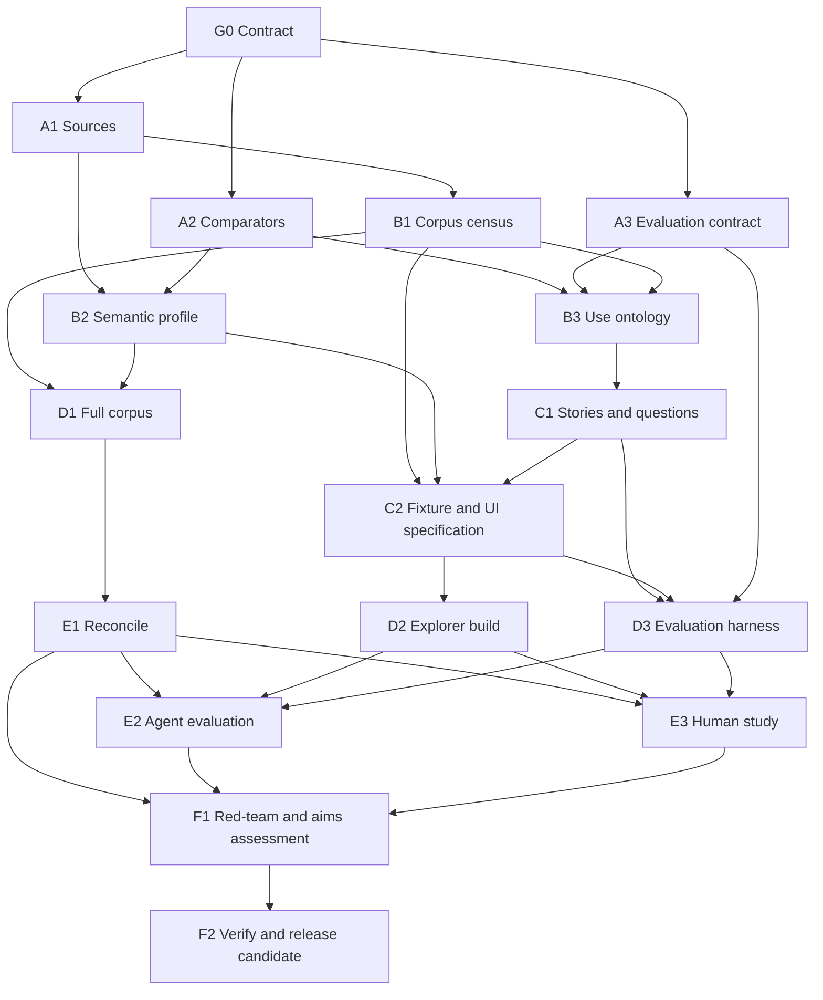

# Agent First, Human Friendly discovery for the whole public GOV.UK corpus

## State-of-the-art research and unattended implementation plan

Status: execution-ready plan  
Prepared: 11 July 2026  
Controlling brief: `WHATS_ON_GOVUK_OKF.md`  
Proposed repository: `chris-page-gov/okf-govuk-content`  
Companion register: `AFHF_GOVUK_OKF_REQUIREMENTS_REGISTER.md`
Populated clause crosswalk: `AFHF_GOVUK_OKF_BRIEF_TRACEABILITY.md`

## Technical summary

The proposal is worth implementing and testing, but it must remain a falsifiable proposition rather than an assumed success. Its strongest potential contribution is not merely “another knowledge graph”: GOV.UK already has content APIs, two search architectures, taxonomies, a GDS Knowledge Graph/GovSearch data product and GOV.UK Chat work. The proposed contribution is a **public, independently reproducible, versioned and source-native semantic catalogue with assertion-level evidence and equivalent human and agent access**.

The implementation boundary is now resolved as follows:

- release 1 covers the **complete, snapshot-bounded public metadata corpus** on the main `www.gov.uk` publishing estate;
- a small cross-section remains an internal engineering fixture only;
- complete page bodies are not mirrored;
- every disjoint candidate key discovered through the frozen union of verified public enumerators/gap detectors must receive exactly one represented, alias, redirect-only, tombstone-only or evidenced-exception disposition; constraints normally annotate those records;
- `unexplained_omissions` must equal zero before release;
- external services and other `*.gov.uk` sites are represented as boundary links unless explicitly admitted later.

This boundary is necessary because no public source alone enumerates all GOV.UK. The public Content API is path-addressed, limited to `www.gov.uk` HTML pages, omits some dynamic and unmigrated content and is rate-limited to 10 requests per second. GOV.UK describes its sitemap as covering the “majority” of pages and its public Search API as unsupported. The official GovSearch/Knowledge Graph documentation also shows that “page”, content item, document, edition, route, redirect and page part are not interchangeable concepts. The corpus must therefore be built by reconciling multiple official enumerators, not by trusting one API. See the official [Content API overview, especially “What you can’t do” and “Rate limiting”](https://content-api.publishing.service.gov.uk/), [GOV.UK reuse guidance, especially “Search API”, “Scraping” and “Sitemap”](https://www.gov.uk/help/reuse-govuk-content), and [GovSearch/Knowledge Graph guide, especially “What a page is” and “The Publishing API Data Model”](https://docs.publishing.service.gov.uk/repos/govuk-knowledge-graph-gcp/how-to-write-queries.html).

The work should use a deterministic data pipeline for census, retrieval, canonicalisation, validation, sharding, search-index construction, metrics and citation checks. Models are reserved for research synthesis, persona/story discovery, ambiguous crosswalks, natural-language question construction, UI reasoning and independent adjudication. No design calls for an LLM invocation per GOV.UK record.

The evaluation framework separates:

1. **discovery** — finding the correct authoritative content item, route, relationship or attachment through the metadata layer;
2. **retrieval** — optionally obtaining authoritative page content from GOV.UK;
3. **answering or action** — a downstream agent or person using that evidence.

That separation prevents the metadata-led Explorer from being unfairly scored as an answer engine while still testing whether it materially improves authoritative retrieval and citation.

## 1. What the controlling brief commits the programme to

The brief requires an independent OKF Bundle Wiki that maps GOV.UK's content and navigation structures, publishers, metadata, taxonomies and relationships. It requires canonical items and URLs, schema families, organisations, browse/taxonomy nodes, lifecycle, redirects, attachments, language, jurisdiction, audience, provenance and static-discovery fields. It also requires an official-source audit, no silent omission, evidence-bearing relationships, Markdown plus YAML-LD, equivalent JSON-LD, static shards, route-scoped adjacency, Explorer registry publication and source-native enrichment.

The new request adds six substantial obligations:

1. test the Agent First/Human Friendly proposition;
2. define a comprehensive, evidenced use ontology, personas and user stories;
3. create 100 questions at both story and persona evaluation levels;
4. specify what Explorer must become to be a preferred human discovery interface;
5. compare the approach with state-of-the-art and analogous systems;
6. make the research, implementation, testing, evidence and citations reproducible under unattended execution.

All 95 atomic requirements and 11 hard acceptance gates are in the companion requirements register. That register is the compliance contract; this document is the execution design.

## 2. Claims that must be bounded rather than overstated

| Phrase | Execution meaning | Prohibited interpretation |
|---|---|---|
| Entire GOV.UK | Complete against the frozen union of declared public enumerators during a stated acquisition window, with every difference classified | Every present or future page on every `*.gov.uk` domain |
| Every use | Saturated coverage of an explicit, evidenced multidimensional use ontology, with residual unknowns published | Every imaginable behaviour by every individual |
| Agent First | Stable IDs, typed structure, deterministic machine access, provenance and efficient search/fetch/traversal | An LLM-generated summary layer |
| Human Friendly | Accessible, task-effective progressive discovery for named user groups | A graph-first interface or a claim that Explorer replaces GOV.UK transactions |
| UI of choice | Statistically and qualitatively supported preference/effectiveness for pre-registered populations and tasks | Universal preference inferred from synthetic agents or a design review |
| OKF conformance | Base OKF v0.1 plus explicitly named, tested profile extensions | Claiming that base OKF already standardises YAML-LD, typed edges or assertion provenance |

The [OKF v0.1 draft](https://github.com/GoogleCloudPlatform/knowledge-catalog/blob/main/okf/SPEC.md) deliberately specifies minimal Markdown/YAML-frontmatter bundles and says that link semantics may be expressed only by surrounding prose. The GOV.UK profile must therefore label YAML-LD, typed predicates, statement evidence, validation shapes and large-corpus indexes as extensions, not as features already guaranteed by base OKF. The current [YAML-LD 1.0 document](https://www.w3.org/TR/yaml-ld-10/) was still a W3C Working Draft on 8 July 2026; the build must pin a dated version and run round-trip tests to JSON-LD.

## 3. Research questions and falsifiable hypotheses

### Research questions

- **RQ-01 Completeness:** Which public official sources, in combination, give the strongest defensible census of GOV.UK content, and what remains non-enumerable?
- **RQ-02 Semantic fidelity:** Can GOV.UK content items, documents, editions, routes, parts, taxonomies, organisations, lifecycle states and resources be represented without collapsing source-native distinctions?
- **RQ-03 Agent value:** Does the OKF layer improve correct target discovery, multi-hop traversal, citation and efficiency compared with raw official APIs, flat-document retrieval and GOV.UK search?
- **RQ-04 Human value:** For which people and discovery tasks does Explorer improve success, time, comprehension, trust and accessibility over current GOV.UK navigation/search?
- **RQ-05 Dual-use trade-offs:** Which shared semantics genuinely benefit both people and agents, and where are distinct presentations or interfaces necessary?
- **RQ-06 Comparator lessons:** What can be reused from GOV.UK Search v2, GovSearch/GovGraph, GOV.UK Chat, linked-data portals, public-service vocabularies and other national portals?
- **RQ-07 Sustainability:** Can full-corpus publication remain reproducible, fresh, affordable and performant with static-first distribution?
- **RQ-08 Governance:** Can rights, robots, provenance, inference, prompt-injection and change risks be handled transparently without silent omission?

### Hypotheses

- **H-01 Corpus:** every item in the declared source union can be represented or explicitly exceptioned, with zero unexplained omissions.
- **H-02 Semantics:** at least one reversible source-to-profile mapping exists for every admitted source field, and no source-native class is silently conflated.
- **H-03 Agent retrieval:** under matched model, prompt and budget, OKF-assisted agents succeed only if either (a) effectiveness is superior and efficiency remains within a preregistered guardrail, or (b) effectiveness is non-inferior and efficiency is superior; effectiveness covers Recall@k, nDCG/MRR, citation validity and end-task success, while efficiency covers latency, steps, bytes, tokens and cost.
- **H-04 Human discovery:** for selected discovery tasks, Explorer is non-inferior on task success and improves at least one of time, path comprehension, provenance comprehension or confidence calibration.
- **H-05 Trust:** exposing lifecycle, origin, evidence and inference status reduces unsupported answers and incorrect use of stale or wrong-jurisdiction content.
- **H-06 Portability:** the canonical YAML-LD and JSON-LD representations are semantically equivalent and consumable without Explorer-specific code.
- **H-07 Enrichment:** model-assisted enrichment adds measurable discovery value without reducing precision below the pre-registered threshold.

Failure of a hypothesis is a valid result. The programme must never optimise the evaluation towards a favourable conclusion.

## 4. Dependency-aware programme



### Parallelism and critical path

- A1 source audit, A2 comparator research and A3 evaluation design begin together.
- B1 census and B2 semantic profile proceed in parallel once source contracts are known.
- B3 use ontology starts from official structure and public research while B1 adds observed long-tail content classes.
- Persona/story work partitions by actor/journey family; questions partition by story hash.
- Corpus hydration partitions by stable identifier hash but shares one domain-wide rate limiter. Independent workers must not multiply GOV.UK's 10-request-per-second public limit.
- Explorer shell, agent interface and evaluation adapters can proceed against the fixture while the full census is hydrated.
- Corpus reconciliation, integration, human study, final synthesis and release verification remain deliberate serial gates.

## 5. Work packages, outputs, model tiers and acceptance

| ID | Lead role | Outputs | Starting execution tier | Hard acceptance |
|---|---|---|---|---|
| G0 | Programme orchestrator | Charter, DAG, budgets, boundaries, approval manifest | Deterministic | Acyclic DAG; typed inputs/outputs, retries, owner and budget for every task |
| A1 | Official-source auditors | Interface registry; contract, count, access, licence, robots and rate ledger | Balanced research + deterministic probes | Every candidate source dated and verified; no critical policy unknown |
| A2 | SOTA researchers | Comparator catalogue, literature map, evidence matrix | Deep-research/frontier synthesis | Every material feature claim has a primary or peer-reviewed source and precise locator |
| A3 | Evaluation methodologist | Aim-to-metric matrix, baselines, protocol and thresholds | Frontier | Every aim has indicator, baseline, target, failure meaning and evidence route |
| B1 | Corpus census engineer | Frozen expected-ID/URL union, source manifests and set differences | Deterministic | Each discovered item classified; `unexplained_omissions = 0`; source/watermark hashes present |
| B2 | Semantic architect | GOV.UK OKF profile, contexts, crosswalks, validation shapes | Frontier for disputed mappings; code for validation | Source-native/inferred layers separate; JSON-LD expansion and shapes pass |
| B3 | User-research agents | Use ontology, candidate personas, overlays and evidence | Balanced; frontier challenge | All mandatory facets and observed intent clusters represented or explicitly unresolved |
| C1 | Story/question compiler | Stories, 10 × 10 archetypes, bindings, persona suites and gold evidence | Economy generation → balanced review | 100 instances/story; exactly 100 curated/persona; no unverified gold target |
| C2 | UX/agent architect | Fixture, Explorer epics, agent operations and acceptance tests | Frontier design + balanced coding | Every story/agent operation maps to behaviour and a test |
| D1 | Corpus pipeline | Full records, manifests, search and adjacency shards | Deterministic | Frozen inventory reconciles exactly; every shard counted, checksummed and schema-valid |
| D2 | Explorer engineers | Implemented human UI and agent-facing discovery | Balanced coding; frontier architecture/review | Unit, browser, accessibility, security and performance gates pass |
| D3 | Evaluation engineers | Baseline adapters, event schema, run harness and graders | Deterministic + balanced | Identical question/corpus contracts; no evaluator leakage |
| E1 | Independent reconciler | Closing census, delta sweep, discrepancy and drift reports | Deterministic + independent review | Per entity class: `expected_candidate_keys = represented + alias_of_represented + redirect_only + tombstone_only + exceptioned`; `unexplained_omissions = 0` |
| E2 | Agent evaluator | Paired retrieval/answer/efficiency runs and confidence intervals | Economy/balanced execution; frontier adjudication | Pre-registered replicas and strata complete; raw traces retained |
| E3 | Human research lead | Consented study, accessibility sessions and analysis | Human-led | Recruitment, ethics, accommodations and counterbalanced protocol satisfied |
| F1 | Red team/synthesis | Aim scorecard, negative evidence, limitations and residual risks | Independent frontier configuration | Every judgement traces to metrics; contrary evidence retained |
| F2 | Release verifier | Verified bibliography, claim ledger, SBOM, checksums and release candidate | Deterministic + independent semantic verifier | Every released claim/citation and artefact hash passes |

## 6. SOTA research method and comparator programme

### Evidence hierarchy

1. normative standards, official GOV.UK documentation, official repositories and versioned API responses;
2. peer-reviewed papers and original benchmark publications;
3. maintainer-authored design records, source code and public evaluation artefacts;
4. official case studies and vendor technical documentation, labelled as such;
5. commentary and secondary reporting only for discovery, never as sole support for a material claim.

Each research agent must record its query, date, databases/sites searched, inclusion/exclusion decision, version or commit and unresolved evidence. Results are synthesised by claim ID, not copied as narrative summaries. At least one workstream is tasked explicitly with evidence against the proposal.

### Reproducible scoping/systematic-review protocol

Search, at minimum, GOV.UK/GDS developer docs, official `alphagov` repositories, W3C, SEMIC/Interoperable Europe, OpenAPI/MCP/A2A specifications, Crossref and OpenAlex, ACM Digital Library, ACL Anthology, IEEE Xplore, arXiv, Google Scholar for citation chaining, GitHub releases/issues and official national portal/API repositories. Freeze `review_cutoff`, search dates, tool/API versions, languages and repository scopes in `research/protocol.yaml`; log each query/result in `research/searches.jsonl`. Searches run in English; Welsh and comparator-country official terminology are added where they expose otherwise missed public-sector work. The evidence cutoff is the T0 date, with a final delta search before F2.

Versioned query blocks combine:

1. government/public-service/content catalogue/knowledge graph/linked data;
2. agent/LLM/RAG/GraphRAG/MCP/search/fetch/provenance/citation;
3. information architecture/findability/exploratory search/user needs/accessibility/assisted digital;
4. GOV.UK/content API/search API/taxonomy/GovGraph/GovSearch/GOV.UK Chat;
5. evaluation/benchmark/relevance/task success/efficiency/trust.

Include normative/official system descriptions, source code, empirical public evaluations and peer-reviewed methods that inform a research question or comparator dimension. Exclude undated derivative marketing, unsupported commentary, inaccessible claims without verifiable metadata and generic AI work lacking a discovery/evaluation connection. Two independent screeners review titles/abstracts and then full text; disagreements are adjudicated and inter-rater agreement reported. Deduplicate by DOI/URL/title, appraise authority, method transparency, population/task fit, reproducibility, recency and conflicts of interest, and retain exclusion reasons.

Perform backward/forward citation snowballing on included landmark papers and repository/document link chasing on official systems. Maintain a separate negative-evidence stream for failures, null results, accessibility harms, provenance limitations and reasons the proposal may add no value. Stop broadening only after two successive query/snowball passes add less than 1% new eligible claim families and every comparator family below has current primary evidence; publish unresolved gaps and the full search log.

### Mandatory comparator families

| Family | Specific systems to inspect | Question the comparison must answer |
|---|---|---|
| Current GOV.UK discovery | Search API v1; Search API v2/Google Agent Search; mainstream browse; topic taxonomy; organisation pages | What do current human and programmatic routes already solve? |
| GOV.UK content graph/data | Content API; Publishing API model; content schemas; GovGraph/GovSearch | Which authoritative identities, editions and edges already exist, and which are public? |
| GOV.UK generative discovery | GOV.UK Chat engineering, retrieval and public pilot evidence | Does OKF add value beyond hierarchical chunks, metadata filters, reranking and citations? |
| Existing project | Current OKF Explorer, large CKAN corpus and overview-context design | Which capabilities exist, fail at scale or need GOV.UK-specific semantics? |
| Knowledge packaging | OKF v0.1; YAML-LD; JSON-LD; RO-Crate where relevant | Which guarantees are normative and which are project extensions? |
| Semantic catalogues | DCAT 3/DCAT-AP; SKOS; PROV-O; SHACL; Schema.org; W3C ORG | Which concepts can be reused without mistyping general content as datasets/services? |
| Public-service models | CPSV-AP; GOV.UK content schemas; life-event/service models | How should services, eligibility, evidence, channels and legal resources be represented? |
| International government portals | Canada.ca; USA.gov/Search.gov; data.europa.eu; selected national portals | What evidence exists for task-based, semantic and human/agent discovery? |
| Adjacent UK content APIs | NHS Website Content API; legislation and data catalogues | What can be learned from narrower authoritative structured-content systems? |
| Agent protocols | MCP Resources and search/fetch; A2A discovery; OpenAPI/Arazzo boundaries | How should durable knowledge, resource delivery and executable workflows remain distinct? |
| Retrieval research | BM25; dense/sparse/late-interaction; RRF; graph retrieval; BEIR/KILT/MTEB | Which retrieval family wins on this corpus rather than on generic benchmarks? |
| Agent benchmarks | GAIA; BrowseComp; WebArena; AssistantBench | Which practices support reproducible end-task and tool-trace evaluation? |

The closest comparator is the official GOV.UK Knowledge Graph/GovSearch stack, but its own documentation says practical uses are presently relational/analytical and access is primarily internal. The comparison must therefore test whether OKF's public reproducibility and evidence model are genuine differentiators, not ignore prior work. See [GovSearch/Knowledge Graph guide](https://docs.publishing.service.gov.uk/repos/govuk-knowledge-graph-gcp/how-to-write-queries.html), [technical debt note](https://docs.publishing.service.gov.uk/repos/govuk-knowledge-graph-gcp/technical-debt.html), and [GovSearch application](https://docs.publishing.service.gov.uk/repos/govuk-knowledge-graph-search.html).

## 7. Comprehensive use ontology, personas and stories

Personas must be a view over a more fundamental use ontology, not a collection of invented biographies. The ontology is:

`actor × job-to-be-done × domain/content family × journey stage × jurisdiction × urgency/risk × language/access need × device/connectivity × authentication × intermediary/delegation × human/agent channel`.

Evidence sources are sampled deliberately: the complete official document/schema/content-type inventory; lawful, de-identified search/query and support/contact themes where authorised; published service and user research; accessibility and assisted-digital evidence; public performance/analytics evidence; helpdesk/frontline research; statutory/equality impacts; and comparator studies. Each use class records evidence quality as `direct_observation`, `authoritative_research`, `aggregate_behaviour`, `expert_evidence`, `comparator_transfer` or `hypothesis`, plus date, population, limitations and source locator.

Agent/intermediary personas also record principal, delegation basis, consent/authority, permitted disclosure/action boundary, authentication hand-off, review/appeal and harm if authority is misunderstood. Coverage challenge explicitly examines protected/equality-relevant and intersectional access contexts without turning them into demographic stereotypes; all safety-, rights-, benefits-, immigration-, justice- and emergency-adjacent classes receive a high-harm review.

### Planning seed

The initial research seed is 48 primary archetypes. The final count may merge or add archetypes through evidence and set-cover analysis, but no coverage cell may disappear silently.

| Group | Seed count | Required families |
|---|---:|---|
| Public and life-event users | 18 | routine resident; multi-service life event; benefits; tax/pensions; parent/carer; bereavement; work/jobs; driving/travel; education; housing/local services; health/safety/environment; justice/rights; immigration/citizenship; living abroad; overseas visitor; urgent/high-stakes; appeal/historical evidence; government activity/news |
| Business and organisations | 8 | founder/sole trader; SME/employer; large or regulated organisation; importer/exporter; charity/community body; supplier/grant applicant; professional adviser; developer/commercial reuser |
| Public-service/professional/intermediary | 10 | frontline adviser; local government/NHS officer; policy official; caseworker; content publisher; service/user researcher; accessibility specialist; analyst/statistician; legal/parliamentary researcher; journalist/librarian/archivist/auditor |
| Agent and system actors | 12 | navigation agent; grounded Q&A/citation agent; life-event planner; eligibility/obligation explainer; transaction hand-off agent; business-compliance agent; policy/legal researcher; content-reuse agent; change monitor; crawler/indexer; data/API/attachment discovery agent; provenance/audit/adaptation agent |

Accessibility, Welsh or other language, low literacy/digital confidence, low bandwidth, mobile-only, delegated use, privacy sensitivity, urgency and geographic/jurisdictional context are reusable overlays across the archetypes, not stereotypes confined to a single persona.

### Persona card contract

Every persona record contains:

- stable ID and version;
- actor and channel class;
- evidence status: `observed`, `evidence_backed_plausible` or `hypothesised`;
- evidence and source locators;
- trigger, primary outcome and jobs-to-be-done;
- relevant content families, topics and services;
- journey stages and typical relationships traversed;
- capabilities, knowledge and digital context;
- access/language/jurisdiction overlays;
- urgency, decision risk and harms of failure;
- trust and provenance needs;
- success criteria and exclusion/anti-persona notes;
- linked user stories and evaluation questions.

Each archetype normally carries 6–12 stories. Stories use the form: **Given [context/trigger], as [actor], I need [discover/understand/verify/act outcome], so that [real-world outcome]; accepted when [observable condition]; failure harms [specified harms].**

### Completeness and saturation

1. derive facets from official GOV.UK structure, content types, user research, search evidence and support evidence;
2. generate candidates independently by domain and actor family;
3. cluster and deduplicate without erasing edge cases;
4. use set cover to select the smallest primary persona set covering mandatory cells;
5. use pairwise covering arrays across overlays, plus explicit three-way or higher combinations for high-risk cases;
6. run two independent gap passes with held-out evidence;
7. stop only after two passes add less than 1% novel valid use classes, all high-harm cells are covered and residual unknowns are published;
8. validate synthetic hypotheses with real users before using them to support a “UI of choice” conclusion.

This follows the evidence-first principle in the [Government Design Principles](https://www.gov.uk/guidance/government-design-principles), the government's definition of [user needs](https://www.gov.uk/service-manual/user-research/start-by-learning-user-needs), and its guidance on [writing user stories](https://www.gov.uk/service-manual/agile-delivery/writing-user-stories). Pairwise/t-way coverage is an efficiency technique, not a substitute for qualitative research; the implementation should record the exact covering-array strength and exceptions, drawing on [NIST combinatorial-testing guidance](https://www.nist.gov/programs-projects/combinatorial-testing).

## 8. Question factory: complete coverage without waste

To satisfy both readings of “100 questions for each”:

- every approved story has exactly 100 renderable question instances;
- every primary persona has an exactly 100-question curated evaluation suite drawn from its story-bound pool;
- all questions are stored as typed bindings and deterministic renders, so the project does not require 100 independent model calls for each story.

### Story-level 10 × 10 construction

| Ten operations | Ten challenge modes |
|---|---|
| locate a known item | direct, well formed |
| explain or define | novice/colloquial wording |
| determine applicability | synonym, spelling or noisy wording |
| follow a process | temporal/current-versus-historical |
| compare or decide | geography/jurisdiction |
| traverse hierarchy/relationships | language/access/connectivity |
| verify provenance or authority | multi-hop |
| check lifecycle/redirect/freshness | conflicting or missing evidence |
| obtain attachment/data/API representation | structured agent request |
| handle ambiguity, delegation or no answer | safety/high-stakes/unanswerable |

Encode operation/challenge compatibility as a versioned constraint matrix, not an informal prompt. The deterministic solver assigns exactly one valid binding to every 10 × 10 cell; an incompatible cell is replaced only by a predeclared variant that preserves both its operation and challenge coverage labels. It then rejects/regenerates individual bindings until all 100 are grammatical, story-applicable, unique, independently gold-valid and quota-preserving. The release records the matrix version, solver seed, rejected candidates and proof that each row/column count remains ten.

### Persona-level curated 100

Each primary persona suite uses this fixed quota unless pre-registration records a justified variation:

- 12 locate/navigate;
- 12 explain/understand;
- 10 applicability/eligibility/obligation boundary;
- 10 procedure/next step;
- 8 compare/choose;
- 8 temporal/current/historical/change;
- 8 jurisdiction/language/audience;
- 8 relationship/multi-hop;
- 8 attachment/data/API;
- 6 provenance/citation/verification;
- 5 negative/no-answer;
- 5 ambiguous/adversarial/noisy.

### Question record

Each question stores `question_id`, `story_id`, `persona_ids`, `operation`, `challenge`, wording, channel, expected response type, risk, difficulty, ambiguity, locale, jurisdiction, temporal sensitivity, graded relevance judgements, multiple acceptable content/relationship/citation targets and paths, disallowed near-misses, expected abstention or unanswerable rationale, snapshot ID, generation method, independent assignments, adjudication, split and checksum.

Gold targets must be verified independently of the generator. Questions are frozen and checksummed before comparison. Exact normalisation, lexical overlap and embedding/paraphrase clustering run before acceptance; the duplicate decision threshold is calibrated on a labelled pair set and frozen in preregistration, with borderline pairs independently adjudicated. No two accepted questions may be equivalent in intent, constraints, target set and challenge. Prompt/test leakage checks run before acceptance. At least 20% remains a held-out test set, invisible to retrieval tuning and UI implementation agents.

## 9. Complete public-corpus acquisition and semantic compilation

### 9.1 Source audit before architecture choice

Do not assume that the candidate interfaces are current, complete or stable. At execution time, verify at least:

- GOV.UK Content API contract, common fields, beta status and rate limit;
- public Search API v1 fields, paging, exclusions and unsupported status;
- Search API v2 architecture and whether any reproducible public access exists;
- sitemap index, shard count, update cadence, derivation and exclusions;
- `robots.txt` and operational throttling;
- current Publishing API/content schemas and their commit;
- organisation, taxon, mainstream browse, collections, step-by-step and world-taxonomy entry points;
- attachment and asset representations;
- schema.org markup on rendered pages;
- redirects, gone/withdrawn/substituted content and historical pointers;
- public reuse terms, OGL scope and third-party exceptions;
- whether any documented bulk/feed surface has become available since this plan.

The public Search API allows paging and up to 1,500 results per request, but GOV.UK labels it unsupported. Search API v2 powers current site search using Google Cloud Agent Search/Discovery Engine and is intentionally only minimally compatible with v1. These facts make both essential comparators but unsuitable as an unqualified single source of truth. See [Search API usage](https://docs.publishing.service.gov.uk/repos/search-api/using-the-search-api.html), [Search API v2](https://docs.publishing.service.gov.uk/repos/search-api-v2.html) and [Search API v2 compatibility](https://docs.publishing.service.gov.uk/repos/search-api-v2/search_api_compatibility.html).

### 9.2 Frozen census

At `T0`, form a candidate union:

\[
U=S_{sitemap}\cup S_{search-v1}\cup S_{linked-content}\cup S_{curated-routes}\cup S_{resources}\cup S_{rendered-links}
\]

where each set is versioned, counted and hashed. Hydrate candidates using the public Content API where applicable, resolve HTTP status/redirects and recursively follow only source-authoritative navigation and relationship fields. At `T1`, re-enumerate, apply deltas and close the consistency window.

The terms in the union are executable contracts:

- `S_sitemap`: every URL in every shard referenced by the frozen sitemap index, retaining shard URL, ordinal, `lastmod`, retrieval time and hashes;
- `S_search-v1`: a provably exhaustive union of non-overlapping leaf queries over the public search index, with each leaf's filters, reported total, paging requests, returned count and checksum retained;
- `S_linked-content`: canonical IDs/base paths reached only from typed Content API/Publishing-model link fields of already admitted records, with predicate and source record retained—never an unbounded crawl of arbitrary body links;
- `S_curated-routes`: documented public special-prefix/index surfaces for organisations, browse, topics, world, step-by-step, collections and other verified route families that may not appear as ordinary content items;
- `S_resources`: attachment, document, image, data/API and machine-representation URLs declared in structured source fields, plus their rights and parent evidence.
- `S_rendered-links`: allowed same-host targets found by the bounded rendered-link gap detector and independently resolved as public canonical/redirect/API-backed candidates.

For Search API v1, never treat the 1,500-result maximum request size as corpus coverage. Begin with a count-only root query. Recursively split any query whose result count cannot be exhaustively paged into mutually exclusive source-supported facet ranges—prefer document type/schema, locale, organisation and bounded date/key ranges—and prove for every leaf that `reported_total = unique_rows_returned` and it is within the retrievable cap. Store the partition tree and predicates; test sibling disjointness, parent/child count reconciliation and global deduplication by canonical identity. If no supported partition can close a branch, record that branch as a source constraint and cover it through independent enumerators rather than silently truncating it.

Permitted recursive discovery is breadth-first over the structured authoritative links above with a visited canonical-ID set, declared predicate allowlist and per-source depth/volume alarms. Because the sitemap is Search-derived, run an additional robots/reuse-compliant same-host rendered-link **gap detector**: transiently parse admitted public pages, canonicalise unseen `www.gov.uk` targets, enforce route allow/deny rules and bounded alarms, and admit a target as a candidate when it resolves to an allowed canonical 2xx/redirect or a Content API record. Retain source page and DOM-link evidence, discard body text, and report the `link-discovered-only` set separately. Assets become resources and off-host targets become boundary links. The detector is corroborating discovery—not proof that arbitrary prose links are authoritative relationships—and never follows external hosts.

The union contains source observations, not one countable kind of thing. Normalise it into disjoint candidate ledgers before reconciliation:

```yaml
candidate_key: sha256(entity_class | source_native_id | locale | route_or_resource_uri)
entity_class: content_identity | document | edition | route | resource
source_native_id:
locale:
route_or_resource_uri:
source_memberships: []
canonical_content_id:
snapshot_id:
coverage_disposition: represented | alias_of_represented | redirect_only | tombstone_only | exceptioned
disposition_target:
constraints: []
evidence_ids: []
```

Exactly one `coverage_disposition` is allowed per candidate key. A constraint is normally an annotation on a represented/redirect/tombstone candidate; `exceptioned` is used only when the candidate cannot lawfully or technically be represented and must carry reason, evidence, owner and retry/review date. Content identities, locale documents, editions, routes and resources reconcile in separate tables and are never added together as if they were “page” counts.

Publish two distinct results: **accounting closure**, which requires every candidate key to have one disposition and `unexplained_omissions = 0`; and **representation success**, which reports represented/alias/redirect/tombstone rates and the exception rate by class/reason. Accounting closure cannot be worded as full data coverage when material exception rates remain. The preregistration sets class-specific exception ceilings and vetoes for authoritative/high-harm classes after the source audit establishes what is attainable.

Publish set differences including:

- sitemap-only, search-only and relationship-only candidates;
- Content-API-unavailable or placeholder paths;
- non-English/locale differences;
- attachments and external links;
- redirects, gone, withdrawn, substituted and tombstoned items;
- page parts versus canonical content items;
- dynamic, disallowed, inaccessible or rights-constrained classes;
- source counts by document type, schema, locale, organisation and lifecycle.

“Complete” means all candidates admitted by the declared public-source contract are reconciled, not that an unknown item can be proved not to exist.

### 9.3 Canonical entity distinctions

The profile must distinguish at least:

- `ContentItem` — stable GOV.UK content identity;
- `Document` — locale-specific member of a content item;
- `Edition` — version/lifecycle state where publicly observable;
- `Route` and `BasePath` — address and prefix behaviour;
- `RenderedPage` or `Part` — browser-visible page/section derived from an item, crosswalked to `schema:WebPage` only where its semantics fit;
- `ContentType` and `SchemaFamily` — retained separately from document type;
- `Organisation`, including publishing, owning, lead and sponsoring roles;
- `Taxon`, `MainstreamBrowsePage`, `WorldTaxon`, `StepByStep`, `Collection` and other navigation constructs as separate source-native types;
- `GovernmentService` only where the source supports a genuine service;
- `Attachment`, `Distribution` and `MachineRepresentation`;
- `Redirect`, `Withdrawal`, `Gone/Tombstone`, `Replacement`;
- `EvidenceSource`, `AcquisitionActivity`, `InferenceActivity` and `ConstraintRecord`.

This distinction is required because GOV.UK's own knowledge-graph guide says there is no single agreed definition of a page and describes content items, locale-specific documents, editions, routes and multi-part pages separately. See [“What a page is” and “Content items, documents and editions”](https://docs.publishing.service.gov.uk/repos/govuk-knowledge-graph-gcp/how-to-write-queries.html).

### 9.4 Evidence-bearing relationships

Edges include the brief's `published by`, `owned by`, `part of`, parent/child, `classified under`, related, links-to, replacement, redirect, attachment, content-type and language relations, plus source-native predicates discovered during audit. Every assertion stores:

- subject, predicate and object IDs;
- source-native field/link type;
- evidence URL and precise locator or JSON Pointer;
- source retrieval and effective times;
- acquisition/derivation method and software version;
- source-declared versus inferred status;
- confidence and reviewer where inferred;
- supersession/invalidation where applicable.

Represent evidence-bearing edges portably as deterministic `govuk:Assertion` nodes rather than relying on undocumented RDF-star support. Each assertion has its own stable ID plus `govuk:subject`, `govuk:predicate`, `govuk:object`, source-native predicate, evidence IDs, declared/inferred status, derivation activity, confidence and validity interval. A compiled convenience edge may coexist for traversal, but it must point back to the assertion and be reproducible from it. SHACL enforces exactly one subject/predicate/object and the required evidence fields.

Use PROV-O as an interoperability mapping for entities, activities, agents, derivation and attribution, not as a replacement for the simpler project-native ledger. [PROV-O](https://www.w3.org/TR/prov-o/) explicitly provides those classes and relations. Use SKOS for taxonomy concepts/labels/relations, SHACL for graph constraints and DCAT 3 patterns only for catalogues, resources, distributions, services, versions and checksums that truly fit those concepts.

### 9.5 Deterministic pipeline

1. enumerate and snapshot source manifests;
2. fetch with one global host token bucket, exponential back-off, conditional requests and resumable cursors;
3. store a lawful, frozen source-native metadata envelope sufficient to rebuild the release: allowed response fields, status/redirect headers, source/version/retrieval metadata and hashes; exclude body fields by allowlist, or parse required inline links/schema.org in a transient isolated stage and retain only typed extracted assertions plus body hash;
4. canonicalise URL, ID, locale and lifecycle keys deterministically;
5. transform source-native records to the GOV.UK OKF profile;
6. validate required fields, JSON-LD expansion, SHACL/JSON Schema, referential integrity and inverse-edge rules; convert YAML-LD to JSON-LD, expand both, canonicalise each RDF dataset as canonical N-Quads with [W3C RDFC-1.0, Recommendation 21 May 2024, §§4–5](https://www.w3.org/TR/2024/REC-rdf-canon-20240521/) and SHA-256 using a pinned conforming implementation, and require canonical digest equality on round-trip fixtures and every release shard;
7. compile YAML-LD, equivalent JSON-LD, descriptors, overview analysis, lexical/hybrid search and adjacency shards;
8. reconcile counts and source differences;
9. run model enrichment only over the unresolved/enrichment queue;
10. revalidate and publish source-native and inferred layers separately.

“Rebuild frozen release” consumes the retained frozen metadata envelopes and must reproduce canonical outputs without contacting GOV.UK. “Reacquire current site” performs a new T0/T1 run and is expected to differ. Raw full page bodies are neither required nor retained for frozen metadata reproducibility. Inline `links to` assertions may be extracted transiently only if the source audit, robots/reuse review and profile explicitly admit them; they retain DOM/JSON locator fingerprints, while the body itself remains absent from the published bundle.

### 9.6 Sharding and distribution

Use immutable snapshot IDs and stable content-key sharding based on a hash of `content_id + locale`, falling back to canonical URL only when no content ID is available. Never shard by mutable title, topic or organisation.

Each shard records schema version, count, first/last key, compressed/uncompressed size, SHA-256 and source snapshot. Keep record, search and adjacency shards separate. Publish a release-level Merkle root or equivalent manifest root.

The first browser request loads only the descriptor, source/coverage summary, aggregate overview, facet analysis and search manifest. Record and edge shards hydrate only for the active query/context. This follows the existing Explorer design principle that every view shares an active reduced context and that large corpora require a generated overview before full hydration. See [OKF Explorer overview-context design, especially “Principle”, “Left Panel”, “Generated Analysis Artifact” and “View Contexts”](https://github.com/chris-page-gov/ai-infrastructure-wiki/blob/main/docs/explorer-overview-context.md).

Run `B1-03` immediately after the T0 union: compile a statistically conservative sample containing large records, dense relationships, every schema family and long-tail attachments; extrapolate file count/storage; then load-test descriptor, search and graph paths on low/mid reference devices. Freeze objective p95 render/query, browser-memory, shard-size, storage and monthly-bandwidth budgets before D1/D2 scale-out.

Starting ceilings for the spike are: ≤2 MiB compressed bootstrap before first useful interaction; ≤5 MiB compressed ordinary shard; warm local search p95 ≤500 ms and cold first query p95 ≤1.5 s on the declared mid-tier device; first useful render p75 ≤2.5 s on the declared throttled profile; steady browser heap ≤512 MiB; and one graph expansion ≤250 nodes/500 edges unless the user explicitly requests more. B1-03 may tighten these or record a measured, user-tested ADR for a relaxation; silent budget drift is a failure.

Predefine the split: the **control plane** is the independent repository and Pages-hosted shell, canonical descriptors, schemas, documentation, fixtures, registries, manifests and checksums; the **data plane** is immutable content-addressed record/search/adjacency shards. Pages may serve both only if the capacity spike passes. Otherwise the data plane uses approved release assets or object storage/CDN with versioned immutable URLs and integrity hashes, while scope remains unchanged. A1-03 also freezes the release/freshness SLA, maximum source lag and drift response after measuring source update capability and user-risk strata.

## 10. Explorer changes required for a preferred human discovery interface

“Human UI of choice” is not achieved by adding more graph tabs. The UI needs a task-first simple path and progressively disclosed research depth, all backed by the same active context.

### 10.1 Pin the implementation baseline before editing

The available overview-context document establishes design concepts, not a current code diff. Task `C2-01` must therefore resolve the actual Explorer repository, pin the audited commit and lockfile, run its existing tests and record routes, components, state/reducer shape, loaders, generated-analysis contract, shard manifest, accessibility state and performance profile. If code access is unavailable, D2 is blocked rather than pretending that a prose design is the implementation.

Produce `explorer/design/baseline-gap-matrix.yaml` with one row per route/component/data contract and: `baseline_commit`, `current_path`, `current_behaviour`, `keep_extend_replace_new`, linked UX epic, stories/questions, proposed files, migration, tests, risk and evidence. Re-run the matrix if the baseline commit changes.

The expected change map—subject to that pinned audit—is:

| Existing concept to locate | Required implementation change |
|---|---|
| Overview-context bootstrap | Load snapshot/coverage/constraint summaries before record shards; surface derived/non-authoritative status |
| Global context reducer | Add serialisable query, facet, route, lifecycle, language/jurisdiction and mode state shared across every view |
| Generated analysis artefact | Add cardinality, entropy, coverage, long-tail and shard-planning fields with schema/version checks |
| Search/list view | Replace any file-tree-first entry with task-first search, result evidence, ranking explanation and accessible pagination/virtualisation |
| Graph/hierarchy views | Aggregate first, bound expansion and implement equivalent list/table/breadcrumb paths |
| Type/resources/timeline views | Preserve GOV.UK source-native types; add attachment rights, editions, redirects, withdrawal/replacement and evidence states |
| Narrative/reader | Add progressive source/inference evidence, canonical GOV.UK hand-off and stable citation/export controls |
| Data loading/index workers | Add immutable manifest resolution, cancellation, caching, integrity checks, Web Worker isolation and failure recovery |
| Router/deep links | Make every active context and selected record replayable against an explicit corpus version |
| Instrumentation/test harness | Add consent-aware task events, Playwright/axe coverage, low-end performance budgets and cross-view state invariants |

No epic is accepted merely because a screen exists: its pinned-code diff, linked tests and persona/story evidence must all pass.

| Epic | Required behaviour | Acceptance evidence |
|---|---|---|
| UX-01 Ask/Find entry | One prominent search/question field; spelling, synonyms, known-item and natural-language support; examples based on persona tasks | High known-item success; keyboard/screen-reader operable; no graph knowledge required |
| UX-02 Explain the corpus | Overview states scope, snapshot, coverage, omissions, provenance and routes into common tasks | New users correctly describe what is/is not covered |
| UX-03 Result cards | Title, summary, type, publisher/owner, status, date, language/jurisdiction, breadcrumb, “why this result”, canonical GOV.UK link | Users choose the correct authoritative item and understand ranking evidence |
| UX-04 Global context reducer | Search and selected facets reduce every view consistently; controls chosen by cardinality/coverage/entropy rather than hard-coded lists | URL-replayable state; no view disagrees about active result set |
| UX-05 Browse and life-event paths | Topic, mainstream browse, organisation, service/journey and curated collections remain distinguishable | Users can navigate without knowing departmental structure |
| UX-06 Evidence panel | Summary, relationships, lifecycle, provenance, raw metadata and source/inference status in progressive layers | Provenance comprehension and correct source recognition improve |
| UX-07 Graph with equivalent list | Aggregate graph first; weighted typed paths; focused expansion; every path has list/table/breadcrumb equivalent | No essential information available only visually; graph task success measured separately |
| UX-08 Timeline/lifecycle | Publication/update/withdrawal/redirect/replacement events, with historical caveats | Users do not mistake stale or redirected content for current guidance |
| UX-09 Compare, pin and export | Compare records/paths; pin a working set; copy stable citation; export selected context as Markdown/YAML-LD/JSON-LD | Researchers can reproduce a selection and agents can consume the same state |
| UX-10 Audience modes | `Simple`, `Explore`, and `Evidence/Developer` presentations over one canonical state; no duplicated truth | Mode changes presentation, not record identity or filter semantics |
| UX-11 Responsive accessibility | GOV.UK Frontend patterns where suitable, WCAG 2.2 AA, 400% zoom, reflow, keyboard, screen-reader and reduced-motion support | Automated, expert and representative-user testing pass; no critical/serious defect |
| UX-12 Large-corpus performance | Web Worker/index isolation, progressive shards, cancellation, caching, virtualised lists and bounded graph expansion | Pre-registered p50/p95 budgets on representative low/mid devices |
| UX-13 Trust and uncertainty | Clear derived-site notice; source-native/inferred badges; confidence only where meaningful; stale/coverage/rights warnings; abstention | Users distinguish evidence from inference and understand missing data |
| UX-14 Agent parity | Every visible record/context has stable machine representation; filters/routes have serialisable expressions | Human and agent views resolve to the same canonical IDs and snapshot |
| UX-15 Ethical instrumentation | Consent-aware events for query, result, facet, route, completion and errors; no sensitive free text retained unnecessarily | Event schema and privacy review pass before human study |

For the static-first deployment, UX-01 is a discovery control, not a hidden answer chatbot. It uses a precompiled lexical index, synonyms/spelling tables, typed filters and optional local/browser-safe reranking to return records, paths and an explicit no-supported-result state. Any remote semantic or generative service is separately consented, disclosed, budgeted and evaluated; it must cite retrieved records and abstain, and the static lexical path remains functional without it.

Ship an accessibility statement and testing record; localise UI chrome and routing for English/Welsh with a general BCP 47 path for other corpus languages; preserve language variants as related records; provide clear GOV.UK/external transaction hand-off rather than simulating transactions; and publish instrumentation purpose, lawful basis/consent, field allowlist, retention/deletion and subject-rights handling. Derived/non-authoritative branding and the canonical GOV.UK destination remain visible in every mode.

The visual language should reuse the [GOV.UK Design System](https://design-system.service.gov.uk/) where appropriate, including its accessible components and generic header for services outside the main GOV.UK proposition. Conformance to [WCAG 2.2](https://www.w3.org/TR/WCAG22/) is a floor. Government guidance explicitly recommends combining performance metrics with user research and usability benchmarking rather than relying only on analytics; see [measuring service success](https://www.gov.uk/service-manual/measuring-success/measuring-the-success-of-your-service) and [usability benchmarking](https://www.gov.uk/service-manual/measuring-success/usability-benchmarking-a-website-or-whole-service).

## 11. Agent-facing discovery layer

The agent interface exposes the same canonical corpus through progressively disclosed, read-only surfaces. A stable, versioned search/fetch/traverse contract with JSON Schemas, error/abstention semantics, pagination, integrity fields and conformance tests is mandatory; it may be implemented as static-library calls and/or HTTP. MCP is an optional adapter over that contract, never the only machine interface.

1. `okf-bundle.yamlld` and equivalent `okf-bundle.jsonld`;
2. compact corpus/coverage/analysis descriptor;
3. paginated/sharded lexical and structured search with typed filters;
4. fetch by canonical ID, URL, content ID or route;
5. relationship traversal with bounded depth and explicit predicate selection;
6. lifecycle, evidence and source/inference views;
7. stable citation object containing canonical GOV.UK URL, content ID, snapshot and evidence locator;
8. optional read-only MCP-compatible façade over the mandatory `search`, `fetch` and traversal contract;
9. deterministic content negotiation or export for Markdown, YAML-LD and JSON-LD.

MCP should be treated as a delivery protocol, not the domain ontology. OpenAPI describes executable HTTP contracts and Arazzo describes operation sequences; neither should cause an informational GOV.UK page to be misrepresented as an executable service or workflow.

Agents treat all retrieved external prose as untrusted data. They must not follow instructions embedded in content, and the read-only research environment must be separated from any write-capable tool context. Renderers sanitise HTML/Markdown, enforce CSP and never execute source scripts.

## 12. Evaluation design

### 12.1 Baselines

Run the same frozen questions and gold evidence against, where access permits:

1. native GOV.UK site search/navigation;
2. public Search API v1;
3. direct Content API discovery from a known path;
4. flat-document/BM25 retrieval;
5. dense semantic retrieval;
6. hybrid reciprocal-rank fusion and metadata reranking;
7. raw OKF programmatic retrieval;
8. OKF graph traversal;
9. proposed Explorer human UI;
10. agent `search`/`fetch` over the proposed corpus;
11. GOV.UK Chat or its published evaluation evidence where direct access is unavailable;
12. GovSearch/GovGraph where authorised, otherwise architectural comparison only.

Add matched ablations so any gain can be attributed rather than credited to “OKF” as an indivisible package:

- single-source inventory versus reconciled multi-source corpus, with the retrieval method held constant;
- the same reconciled corpus as flat canonical JSON versus typed OKF semantics;
- identical expanded RDF expressed as canonical JSON-LD versus YAML-LD, which should be semantically equivalent rather than produce a quality gain;
- typed records with graph traversal disabled versus enabled;
- source-native fields alone versus source-native plus inferred enrichment;
- provenance/lifecycle signals hidden versus exposed to the ranker, agent or human;
- Explorer search/list only versus successive facet, path, timeline and graph capabilities;
- lexical, dense, hybrid and graph-aware retrieval over the same records.

Run one-factor paired ablations first, then a predeclared fractional-factorial subset for plausible interactions among corpus coverage, semantic typing, retrieval and interface. Do not attribute an improvement to serialization when it is actually caused by more content, a stronger ranker or a different UI.

The current GOV.UK Search API documentation already uses manually judged relevance and nDCG to evaluate ranking, making it a natural shared metric and potential source of seed judgements. See [GOV.UK Search Quality Metrics](https://docs.publishing.service.gov.uk/repos/search-api/search-quality-metrics.html).

### 12.2 Metrics

| Layer | Effectiveness | Efficiency/robustness |
|---|---|---|
| Corpus | reconciled coverage, canonicalisation accuracy, field completeness, edge/provenance validity | build time, freshness lag, storage, drift resolution |
| Retrieval | Recall@k, Precision@k, nDCG@k, MRR, facet/path accuracy, answerable classification | latency, bytes/shards read, query reformulations, cost |
| Agent | end-task success, grounded correctness, relationship accuracy, citation precision/recall, jurisdiction/time correctness, appropriate abstention | tool calls, retries, tokens, cost, trace replay, recovery, policy violations |
| Human | task completion and accuracy, correct source recognition, comprehension, trust calibration, preference | time, clicks, backtracks, errors, reformulations, assisted-digital burden |
| UI/system | WCAG/user accessibility success, cross-view consistency, stable routes | first useful render, p50/p95/p99 search, memory, graph expansion and failure rate |

### 12.3 Protocol

- Pre-register questions, systems, corpus snapshot, metrics, thresholds, exclusions and analysis before running comparisons.
- Keep the agent model, prompt, tools and budgets fixed when only the discovery layer should differ.
- Repeat stochastic agent runs; record seeds/parameters and report confidence intervals, not one favourable run.
- Blind relevance and answer adjudicators to system identity where possible.
- Calibrate any LLM judge against human/SME judgements; never use it as the sole ground truth.
- Assign material gold/relevance and answer-quality judgements independently to at least two qualified reviewers, report inter-rater agreement with a measure appropriate to the scale, adjudicate disagreements blind to system identity and retain both original judgements.
- Stratify by persona, intent, content type, organisation, language, jurisdiction, lifecycle, difficulty, risk and access overlay.
- Run all hard/high-harm cases, not only a random sample.
- Run the complete frozen suite for automated systems. Human participants receive a powered, coverage-balanced incomplete-block subset, not thousands of repetitive tasks; the design must represent every primary persona family, operation, challenge class and high-harm class, while each participant completes only the burden approved by ethics and pilot evidence. Personas are sampling/analysis strata, not a rule requiring one participant to impersonate each persona.
- Use paired statistical comparisons and effect sizes. Determine human participant count from a pilot and the minimum meaningful difference rather than choosing a decorative sample size.
- Freeze the non-inferiority margin, alpha, minimum meaningful effect, confidence-interval method, multiplicity family/correction, missing-data rule and stopping rule before inspecting comparative outcomes. Report macro averages by persona/use class separately from prevalence-weighted estimates so stress-test template volume cannot dominate the conclusion.
- Counterbalance human-system order and use equivalent forms to reduce learning effects.
- Report missing data, exclusions, negative findings and source drift.

### 12.4 Hard gates versus pilot-calibrated targets

Hard gates are non-negotiable: zero unexplained corpus omissions; 100% relationship provenance; valid semantics; exact question counts; verified gold targets; no critical accessibility/security issue; complete citation verification; reproducible release manifest.

Relative performance thresholds are calibrated by the pilot. Explorer cannot claim success merely for beating a weak baseline; it must at minimum be non-inferior to current GOV.UK discovery on primary task success and must add a measurable agent, evidence or navigation benefit. Agent performance cannot compensate for a human-accessibility failure, or vice versa.

### 12.5 Security and abuse evaluation

`D2-04` starts from a data-flow threat model and an attack corpus, then tests public content, generated shards, query parameters, imports/exports and agent outputs for prompt injection, stored/reflected/DOM XSS, unsafe Markdown/HTML, malicious or homograph URLs, open redirects, SSRF and DNS rebinding, path traversal, archive/decompression bombs, oversized/deep JSON-LD, RDFC graph-poisoning complexity, shard tampering, cache poisoning, dependency/supply-chain compromise, CSP bypass and leakage through instrumentation. Test integrity/hash failures and safe degraded behaviour. No critical/high issue may remain open; medium exceptions require an owner, compensating control and expiry.

## 13. Assessing whether the aims are fulfilled

### 13.1 Provisional proposal-level assessment

This is the current assessment of the proposal and plan, not a claim about a system that has not yet been built. It separates conceptual adequacy from empirical fulfilment.

| Aim | What the proposal already establishes | Current status | Confidence | What is still required |
|---|---|---|---|---|
| Independent OKF Bundle Wiki mapping GOV.UK | Repository boundary, required artefacts, source-native model and publication route are specified | Partly fulfilled at design level | High | Build and reproduce the full release |
| Whole public GOV.UK coverage | A defensible public boundary, T0/T1 census and zero-unexplained-omission invariant are defined | Not yet fulfilled | High | Execute source audit, partitioned enumeration, hydration and reconciliation |
| Help people navigate and understand GOV.UK | A use ontology, persona/story method and 15 accessible Explorer epics are specified | Plausible but unfulfilled | Medium | Implement, meet accessibility/performance gates and test with real people |
| Become a Human UI of choice | The claim is correctly bounded to named populations/tasks and has a comparative protocol | Not yet testable | High | Complete preregistered participant research; synthetic results cannot satisfy it |
| Help systems understand identities, hierarchy, lifecycle and relationships | Stable entity distinctions, typed edges, source/inference separation and validation are designed | Strongly specified, not yet fulfilled | High | Compile the full corpus and pass semantic/referential tests |
| Help agents retrieve and cite authoritative content | Read-only search/fetch/traversal, citation objects, baselines and efficiency metrics are designed | Strongly specified, not yet fulfilled | Medium | Demonstrate matched gains and safe abstention on frozen questions |
| Compare source metadata, public presentation and discovery | Source registries, comparator families, matched baselines and ablations are defined | Partly fulfilled at research-design level | High | Run the comparisons and publish negative evidence and confidence intervals |
| Reusable semantic/provenance layer | OKF profile extensions, YAML-LD/JSON-LD equivalence, PROV/SKOS/DCAT/SHACL crosswalks and static distribution are designed | Partly fulfilled at architecture level | Medium | Prove portability with independent consumers and versioned releases |
| Transparent, unattended and reproducible execution | Durable controller, contracts, ledgers, gates and citation verification are specified | Fulfilled as a plan; unfulfilled operationally | High | Implement the controller and reproduce a clean run from pinned inputs |

The proposal is therefore strongest on agent-oriented semantic architecture and auditability, credible but still empirical on human discovery, and deliberately unproven on whole-corpus completeness and “UI of choice”. Its chief risk is that the metadata layer may improve discovery and provenance without materially improving ordinary human tasks over GOV.UK's existing search and navigation. The evaluation must be allowed to conclude exactly that.

### 13.2 Final assessment method

Use a non-compensatory scorecard: each aim receives `fulfilled`, `partly_fulfilled`, `not_fulfilled` or `not_yet_testable`, plus confidence and direct evidence. The following veto gates apply:

- incomplete or unreconciled corpus prevents the “whole GOV.UK” claim;
- failed provenance/citation integrity prevents the Agent First claim;
- failed WCAG or human task non-inferiority prevents the Human Friendly/preferred-UI claim;
- absence of genuine participant evidence prevents a human-preference conclusion;
- unreproducible sources or artefacts prevent the independent/federated claim.

For passed veto gates, use a 100-point diagnostic rubric:

| Dimension | Weight |
|---|---:|
| Corpus completeness and freshness | 15 |
| Semantic/source-native fidelity | 15 |
| Agent effectiveness and efficiency | 15 |
| Human task effectiveness | 15 |
| Accessibility and assisted-digital inclusion | 10 |
| Provenance, citation and trust | 10 |
| Interoperability and portability | 7 |
| Performance and scale | 5 |
| Maintainability, cost and reproducibility | 5 |
| Rights, governance and security | 3 |

Weights support diagnosis; they do not override a veto. The final assessment includes strongest supporting evidence, strongest contrary evidence, unresolved questions, sensitivity to threshold choices and confidence.

## 14. Model strategy: capability profiles, not permanently hard-coded names

At run start, resolve current allowed models from official provider documentation, run a small held-out calibration set and write exact IDs, dates, capabilities, pricing and provider policy to `models.lock.yaml`. Tasks refer to the profiles `deterministic`, `economy`, `balanced`, `frontier` and `deep_research`; only the lock file maps profiles to models.

As of 11 July 2026, OpenAI's official model catalogue recommends GPT-5.6 Sol for complex reasoning and coding, GPT-5.6 Terra for an intelligence/cost balance and GPT-5.6 Luna for cost-sensitive high-volume work. The Codex model guide describes Sol as strongest for complex coding, computer use, research and cybersecurity, Terra as balanced and GPT-5.4 Mini as a fast subagent option. These are starting candidates, not proof of fitness for this programme. See [OpenAI Models, “Choosing a model”](https://developers.openai.com/api/docs/models) and [Codex Models, “Recommended models” and “Other models”](https://learn.chatgpt.com/docs/models).

| Work class | Preferred mechanism/profile | Reasoning | Escalation |
|---|---|---:|---|
| Census, crawl, mapping, hashing, sharding, validation, metrics, URL checks | Deterministic code | None | Never use a model where a parser/test suffices |
| Bulk candidate expansion, normalisation suggestions, question wording variants | Economy (current candidate: GPT-5.6 Luna) | Low–medium | Balanced on confidence/schema failure |
| Source extraction, persona/story synthesis, ordinary coding/review, semantic citation check | Balanced (current candidate: GPT-5.6 Terra) | Medium | Frontier for disputed/high-impact cases |
| Ontology design, difficult crosswalks, AF/HF architecture, gap challenge, final synthesis | Frontier (current candidate: GPT-5.6 Sol) | High/xhigh | Max only for a small logged adjudication queue |
| Broad literature/standards sweeps | Dedicated deep-research model or frontier research workflow | Tool-bounded | Independent verification before acceptance |
| Final judgement | Frontier plus a genuinely independent reviewer configuration/provider where permitted | High | Human/domain expert for unresolved material disagreement |

OpenAI's dedicated deep-research documentation currently lists `o3-deep-research` and `o4-mini-deep-research` for long, multi-source research, recommends background execution/webhooks and notes that the API workflow requires a fully formed prompt rather than performing ChatGPT's clarification/rewrite stages automatically. It also exposes `max_tool_calls` as a cost/latency control. Use that class for bounded landscape work, not deterministic corpus ingestion. See [Deep research](https://developers.openai.com/api/docs/guides/deep-research).

The model-routing calibration uses 50–100 representative tasks from each work class. Select the least costly profile whose lower confidence bound meets the pre-registered quality threshold. Re-run calibration when a model, prompt, source contract or output schema changes.

The calibration scorecard records structured-output/schema pass rate, evidence/citation accuracy, coding-test pass rate, tool and context requirements, latency, marginal cost, rate/availability, data retention/region policy and variance across replicas. Selection is Pareto-based with mandatory quality/policy floors, not a single vendor benchmark score. Retrieval components receive their own matched calibration: lexical engine, embedding model, learned sparse model, reranker and graph retriever are chosen on frozen GOV.UK strata using effectiveness, index/build cost, query latency, memory/storage, language coverage and reproducibility.

The generator never grades itself. Prefer deterministic gold evidence; then use an independently assigned reviewer. For disputed material claims, require a genuinely different model family/provider where policy permits or a qualified human audit; a different prompt alone is not independence. A frontier adjudicator resolves only after original outputs/evidence are preserved. Any local/open-weight model is subject to the same provenance and quality gates.

Use asynchronous batch processing for offline question rendering/review and bulk evaluations when it is available and economical. Do not use it for interactive latency benchmarks. Fetch live prices at run start rather than hard-coding a cost estimate.

## 15. Unattended controller and task contracts

Use a deterministic durable controller rather than a conversational “manager agent”. The reference implementation is Python 3.12 with a locked `uv` environment, Pydantic/JSON Schema contracts and SQLite in WAL mode for leases/events; accepted events also export to append-only JSONL. Use `httpx`/async I/O for policy-aware acquisition, DuckDB/Parquet for inventories and evaluation, standards-conformant JSON-LD/RDF tooling for semantic tests, and `pytest` plus Playwright/axe for pipeline and Explorer acceptance. Preserve the pinned Explorer's existing frontend stack; only if no implementation exists should D2 default to TypeScript, a Web Worker search/index layer and static deployment.

### Reference launch defaults

| Control | Unattended default |
|---|---|
| Model/research concurrency | 3 independent tasks; one frontier adjudication at a time |
| Coding worktrees | 3, with disjoint owned paths and serial integration |
| Deterministic transforms | `min(8, available_cpu)` workers; bounded memory queues |
| GOV.UK acquisition | one cross-process token bucket per host; start Content API at 8 requests/s, below its documented 10 requests/s limit, then reduce on latency/429 signals |
| Other URL verification | 2 requests/host and 8 overall unless a lower published limit applies |
| Task attempts | 3; network attempts within an attempt capped at 5 |
| Checkpoints | after every accepted task and every 10,000 acquired records, whichever is earlier |
| Billable work | launch manifest must contain numeric money/token/request/storage ceilings; without them, complete no-cost bootstrap/audit/volume estimation and block only billable queues |
| Budget brakes | stop optional enrichment at 80%; stop starting billable tasks at 95%; checkpoint at 100% |
| Default security | read-only acquisition, no arbitrary source-script execution, secrets only through runtime injection, prompt-injection content treated as data |

`G0-02` computes candidate volume, projected requests, storage and model work before bulk execution. An authorised launch manifest—not a conversational guess—supplies spending and data-region authority. This is the only honest way to make later execution unattended without granting an agent an unbounded budget.

### Materialised task graph

The controller expands the programme work packages into these minimum task contracts. Large rows shard deterministically; every shard inherits the same input/output schema and acceptance test.

| Task | Depends on | Canonical output | Promotion gate |
|---|---|---|---|
| G0-01 import-contract | — | requirements, boundaries, DAG, decisions | 95 requirements and 11 gates parse; no orphan brief clause |
| G0-02 preflight-budget | G0-01 | volume/cost/rate/storage forecast; authorised ceilings | worst-case reservations fit or affected queues block |
| G0-03 bootstrap-controller | G0-01 | controller, schemas, state DB, CI | lease/restart/idempotency/invalid-output tests pass |
| A1-01 source-doc-audit | G0-01 | dated source/interface registry | contract, coverage, version and locator for every source |
| A1-02 policy-probes | A1-01 | access/rate/robots/licence/rights ledger | no unclassified critical policy question |
| A1-03 freshness-SLA | A1-01,A1-02 | release cadence, maximum source lag and drift policy ADR | source capability and user-risk strata justify targets |
| A2-01 comparator-sweeps | G0-01 | claim/evidence/comparator ledgers | primary-source and contrary-evidence gates pass |
| A3-01 preregistration | G0-01 | hypotheses, baselines, metrics, strata, thresholds | every aim has failure meaning and analysis route |
| B1-01 enumerate-T0 | A1-02 | raw enumerator manifests and partition trees | every source leaf closes or records a constraint |
| B1-02 freeze-union | B1-01 | canonical candidate union and set differences | stable IDs; counts/hashes/watermark present |
| B1-03 capacity-spike | B1-02 | measured sample extrapolation and hosting/browser test | control/data-plane choice and objective budgets recorded before full build |
| B2-01 source-model | A1-01,A2-01 | native entity/field/edge catalogue | no unsupported conflation; standards/comparator evidence integrated; examples retained |
| B2-02 OKF-profile | B2-01 | contexts, crosswalks, shapes, round-trip fixtures | JSON-LD expansion/equivalence and shapes pass |
| B3-01 use-ontology | A2-01,A3-01,B1-02 | faceted use ontology and evidence | mandatory cells and observed clusters mapped |
| B3-02 personas-stories | B3-01 | personas, overlays, stories, coverage | two challenge passes and saturation rule pass |
| C1-01 question-bindings | B3-02,A3-01 | 100 bindings/story and persona-suite candidates | exact counts, quota, naturalness and duplicate checks |
| C1-02 gold-verification | C1-01,B1-02 | independent gold IDs/edges/citations and frozen splits | all targets verify; leakage checks pass |
| C2-01 Explorer-baseline | B2-02,C1-02 | pinned commit and baseline-gap matrix | current tests/profile captured; every epic mapped |
| C2-02 representative-fixture | B2-02,C2-01 | all-class fixture and acceptance tests | every schema/edge/lifecycle class represented |
| D1-01 hydrate-corpus | B1-02,B2-02,B1-03,G0-02 | raw metadata/evidence shards | every candidate has a disposition; fetch checks pass |
| D1-02 compile-release | D1-01 | YAML-LD/JSON-LD, manifests, search/adjacency shards | counts, schemas, equivalence, integrity and budgets pass |
| D2-01 build-Explorer-fixture | C2-02 | human UI against representative fixture | functional UX-01–15 and accessibility tests pass on every class |
| D2-02 build-agent-fixture | C2-02,B2-02 | stable read-only search/fetch/traverse contract | canonical-ID parity and contract tests pass |
| D2-03 full-corpus-integration | D1-02,D2-01,D2-02 | production Explorer and agent surfaces | full-corpus integrity, browser memory and latency budgets pass |
| D2-04 security-redteam | D2-03 | threat model, attack corpus and remediation report | injection, XSS, SSRF, path/archive, shard, redirect, CSP and supply-chain gates pass |
| D3-01 build-eval-harness | A3-01,C1-02,C2-02 | adapters, graders, event schemas, ablations | matched conditions and evaluator isolation prove out |
| E1-01 enumerate-T1 | D1-01 | closing enumerator manifests and delta | same contracts as T0; changes classified |
| E1-02 reconcile | E1-01,D1-02 | closing census, discrepancy and drift reports | accounting identity holds; unexplained omissions zero |
| E2-01 automated-evaluation | D2-03,D2-04,D3-01,E1-02 | complete machine runs and paired results | all machine questions/ablations run; CIs and traces retained |
| E3-01 human-evaluation | D2-03,D2-04,D3-01,E1-02 | consented task/accessibility study | H2 authorised; powered balanced design completed |
| F1-00 provisional-machine-synthesis | A2-01,E1-02,E2-01 | provisional non-compensatory scorecard | human aims are `not_yet_testable`; support, contrary evidence and confidence present |
| F2-00 machine-citation-and-trace | F1-00 | verified machine-RC bibliography, claims and requirements status | every released citation, locator, claim and machine requirement passes |
| F2-01 machine-clean-room-RC | F2-00 | independent rebuild/replay report and machine RC | pinned frozen inputs reproduce artefact/metric hashes; machine marker rules pass |
| F1-01 full-aims-synthesis | F1-00,E3-01 | final non-compensatory aim scorecard | human evidence integrated; support, contrary evidence, confidence and limitations present |
| F2-02 full-verification-delta | F1-01,F2-01 | verified final citations, trace, SBOM and checksums | human/final claims and changed artefacts pass all gates |
| F2-03 full-clean-room-release | F2-02 | final independent replay and full completion package | full marker and H4 publication package pass |

The F1-00/F2-01 branch may promote only the machine release candidate while `E3-01` is blocked. F1-01/F2-03 cannot run or promote a fully evaluated AF/HF marker until the genuine human study completes.

### State machine

`queued → leased → running → validating → accepted`

Alternative states are `retryable`, `blocked`, `escalated`, `failed` and `superseded`.

- Tasks are idempotent and keyed by the hash of their contract and input artefacts.
- Each attempt writes only under `runs/<run-id>/tasks/<task-id>/attempt-<n>/`.
- Accepted integration tasks promote canonical artefacts; ordinary agents never edit canonical paths directly.
- Coding tasks use isolated branches/worktrees and merge only after tests.
- Leases, heartbeats, resumable cursors and immutable checkpoints support recovery after interruption.
- The scheduler reserves worst-case cost and rate capacity before starting work.
- No agent receives the full corpus. It receives a bounded evidence packet containing its contract, applicable decisions/schema, exact source extracts and input hashes.
- A summary is never the sole evidence for a downstream factual claim; raw evidence IDs remain attached.

### Agent contract

```yaml
contract_version: 1
task_id:
work_package:
requirement_ids: []
research_question_ids: []
objective:
dependencies: []
idempotency_key:
input_artifacts:
  - uri:
    sha256:
required_capabilities: []
model_profile: deterministic | economy | balanced | frontier | deep_research
allowed_sources: []
source_priority: []
data_classification:
secrets_required: []
output_schema:
output_artifacts:
  - path:
    expected_hash:
acceptance_tests: []
validator_versions: {}
prohibited_actions: []
uncertainty_labels: [confirmed, inference, unresolved]
citation_requirements:
max_concurrency:
rate_bucket:
budgets:
  tokens:
  requests:
  wall_time:
  money:
checkpoint_uri:
human_gate:
on_block: continue_independent | checkpoint | escalate
retry_policy:
stop_conditions: []
```

Required result envelope:

```yaml
status: pass | partial | blocked
claims:
  - claim_id:
    text:
    confidence:
    evidence_ids: []
artifacts: []
coverage:
gaps: []
violations: []
usage:
```

Require concise decision rationales and evidence, never private chain-of-thought. Missing evidence yields `unresolved`, not an invented URL, field, relationship or gold answer.

### Retry and escalation policy

- 429/5xx/timeout: exponential back-off with jitter, shared host token bucket and resumable cursor; maximum five network attempts.
- Invalid schema: deterministic repair if safe, then one same-tier retry, one stronger-tier retry, then block that artefact.
- Evidence disagreement: independent review, then frontier adjudication; human escalation if material and unresolved.
- Citation failure: refetch once, research once, then block the dependent conclusion or issue a dated waiver owned by a human.
- Coverage gap: regenerate only the missing matrix cell/story shard.
- Access, rights or robots uncertainty: never bypass; write a constraint record and stop only the affected branch.
- Default task-attempt cap: three; recursive self-spawning is prohibited.
- Failure-injection CI expires leases, duplicates deliveries, kills workers after write-before-ack, corrupts checkpoints, exhausts quota and restarts mid-shard; accepted outputs must remain single-promoted and byte-identical after recovery.

### Human decision gates

Most work runs unattended, but the following cannot honestly be automated away:

- **H0 contract:** budget, provider/data-region policy and final success thresholds if not already declared;
- **H1 source authority:** any use of authenticated/internal interfaces or uncertain rights/access;
- **H2 human study:** ethics, recruitment, consent, accommodations, participant-data retention;
- **H3 publication architecture:** external immutable shard hosting if Pages capacity is insufficient;
- **H4 public release:** acceptance of residual risks and publication of the evidence-based scorecard.

Absence of a human decision pauses only the dependent branch. The controller continues all safe independent work and produces a complete release candidate and escalation ledger.

The signed launch manifest contains `max_model_cost`, `max_wall_time`, token/request/storage ceilings, provider and data-region allowlists, per-host rate ceilings, external-storage permission, authenticated-source permission, human-study authorisation and publication authorisation. Missing money/provider authority blocks paid fan-out after G0-02; missing H2 blocks E3; missing storage/publication authority blocks only the affected hosting/release action. None may be inferred from the instruction to run unattended.

## 16. Transparent artefact and repository structure

```text
governance/
  charter.yaml
  requirements.yaml
  decisions/ADR-*.md
  risks.yaml
  exceptions.yaml
orchestration/
  dag.yaml
  task-contracts/
  schemas/
  budgets.yaml
  models.lock.yaml
runs/<run-id>/
  manifest.yaml
  events.jsonl
  tasks/
research/
  protocol.yaml
  searches.jsonl
  source-registry.yaml
  comparator-catalogue.yaml
  claims.jsonl
  evidence.jsonl
  citations.jsonl
  bibliography.*
semantic/
  context/
  profile/
  crosswalks/
  shapes/
corpus/
  inventory/
  source-manifests/
  reconciliation/
  records/
  search/
  adjacency/
  drift/
personas/
  use-ontology.yamlld
  profiles/
  overlays/
  coverage.parquet
stories/
  catalogue.jsonl
  coverage.parquet
questions/
  archetypes.yaml
  bindings/
  rendered-shards/
  persona-suites/
  gold/
  coverage.parquet
explorer/
  requirements/
  design/
  src/
  tests/
evaluation/
  protocol/
  baselines/
  agent-runs/
  human-runs/
  results/
provenance/
  activity-ledger.jsonl
  claim-citation-ledger.jsonl
reports/
  aims-scorecard.md
  limitations.md
release/
  manifest.yaml
  citation-verification.json
  requirements-status.json
  checksums.txt
  sbom.*
```

### Run manifest

Every task attempt records run/task/attempt IDs, UTC start/end, Git SHA, contract/input/output hashes, exact model/provider/reasoning parameters, tool versions and calls, source retrievals, validator results, latency, tokens and cost. Secrets, hidden reasoning and unnecessary participant data are excluded or redacted.

The human-readable log is generated from the same append-only events and decision records as the machine ledger. Narrative reports cannot hide a failed requirement, unexplained omission or waived citation.

## 17. Citation and URL verification

Every claim–source pair has a citation object:

```yaml
citation_id:
claim_ids: []
requested_url:
final_url:
retrieved_at:
http_status:
media_type:
title:
publisher:
published_or_updated_at:
version_or_commit:
document_sha256:
locator:
  kind: commit_lines | section_paragraph | page | json_pointer
  value:
  text_fingerprint:
evidence_excerpt:
excerpt_sha256:
licence:
checks:
  reachable:
  identity_matches:
  locator_found:
  excerpt_matches:
  semantically_supports:
  checked_at:
```

### Verification algorithm

1. Parse every released narrative and ensure each factual claim has one or more citation IDs.
2. Fetch using rate-limited `GET`; follow a bounded redirect chain and record each hop, final host/status, MIME type, canonical URL and TLS result.
3. Verify source identity: expected title, publisher, date, version/commit and document hash.
4. Verify the strongest stable locator:
   - Git/source: repository, commit SHA, path, line range and line hash;
   - HTML: heading path/fragment, paragraph ordinal or selector and text fingerprint;
   - PDF: printed/PDF page convention, extracted phrase and page fingerprint;
   - API/specification: dated version and JSON Pointer or numbered section.
5. Confirm the normalised cited excerpt occurs at the locator.
6. Run an independent semantic-support classifier: `entailed`, `partly_supported`, `contradicted`, `unrelated`.
7. Double-check every number, date, named entity and comparative claim deterministically where possible.
8. Re-research a failure once; never silently replace a source with a convenient one.
9. Block a material conclusion unless all required citations pass or a dated, owned waiver is public.
10. Regenerate the bibliography from the verified ledger, ensuring inline citation and bibliography metadata cannot diverge.
11. Recheck citations on each relevant pull request, all citations before release and source/link drift on a schedule.

For mutable GitHub files, final research must use commit-pinned permalinks with line anchors. For W3C and protocol work, use dated/versioned publications rather than `/latest/`. Browser-rendered line numbers are secondary audit metadata, not the durable locator. Store short lawful excerpts and hashes, not unnecessary copyrighted copies.

**Plan-source preflight, 11 July 2026.** All 93 unique URLs cited in this plan were opened and source identity was checked. The ACM landing page initially selected for the RRF paper returned an automated-access `403`, so the released bibliography uses the authors' University of Waterloo copy and retains the DOI as bibliographic metadata. `PLAN_SOURCE_PREFLIGHT.json` records the URL-identity stage separately from locator and claim verification. This preflight establishes link and identity hygiene only; F2 must still pin mutable sources and run the complete locator, excerpt and semantic-support procedure above before treating the implementation's final bibliography as verified.

## 18. Indicative execution waves

These are dependency/capacity estimates, not promised elapsed times. Unattended runtime depends on corpus size, GOV.UK rate limits, model quotas and human-study availability.

| Wave | Parallel work | Exit gate |
|---|---|---|
| 0 — bootstrap | G0; repository; schemas; controller; requirement import | Contract/DAG validates; no unset machine-blocking default |
| 1 — evidence and census design | A1, A2, A3 | Source, comparator and evaluation protocols accepted |
| 2 — freeze and model | B1, B2, B3 | T0 inventory, profile draft and saturated use ontology |
| 3 — compile specifications | C1 story/question compiler; C2 fixture/UI/agent spec | Gold/suite gates and every schema/edge class in fixture |
| 4 — build at scale | D1 full hydration/compilation; D2 Explorer; D3 harness | Full candidate corpus and testable interfaces |
| 5 — close and evaluate | T1 delta; E1 reconciliation; E2 automated runs; E3 authorised human study | Corpus closes; preregistered comparisons complete |
| 6 — challenge and release | F1 red team/aims assessment; F2 verification | Reproducible release candidate; H4 publication decision |

The critical machine path is `A1 → B1 → D1 → E1 → F2`. The critical evidence path for the human-preference claim is `A3 → B3/C1 → C2/D2/D3 → E3 → F1`; it cannot complete without real participants.

## 19. Cost, rate and context controls

- Count corpus candidates `N`, personas `P` and stories `S` before bulk jobs; publish projected volume as `100S` rendered story questions plus `100P` curated persona-suite memberships.
- Fetch current prices/limits at run start and reserve task cost plus contingency.
- At 80% of approved model budget, stop optional enrichment; at 95%, stop starting new model tasks, checkpoint and continue deterministic verification only.
- Deduplicate before model review and cache accepted outputs by contract/input hash.
- Use economy → balanced → frontier escalation, not frontier everywhere.
- Keep stable instructions first in prompts and measure any prompt-cache economics before enabling explicit caching.
- Use PR sentinel tests, nightly stratified model evaluations, release full-corpus reconciliation and incremental drift checks between releases.
- Compress immutable shards; omit full bodies; use conditional HTTP requests where available.
- Make source requests through a shared limiter. Individual agents may not create separate uncoordinated crawl pools.

## 20. Principal risks and mitigations

| Risk | Consequence | Mitigation/gate |
|---|---|---|
| No authoritative public bulk enumeration | “Whole corpus” overclaimed | Frozen multi-source union; set differences; explicit bounded completeness statement |
| Site changes during acquisition | Counts and gold answers inconsistent | T0/T1 watermarks, delta application, snapshot IDs and drift report |
| Search/sitemap/API omissions differ | Silent long-tail loss | Union and recursive authoritative links; zero unexplained differences |
| Page/item/document/edition conflation | Wrong IDs, lifecycle and edges | Source-native entity model and reversible crosswalk tests |
| GitHub Pages capacity | Browser/site failure at full scale | Capacity spike; immutable external shards without reducing scope |
| Metadata cannot answer substantive questions | Unfair or misleading evaluation | Separate discovery, retrieval and answering stages |
| Synthetic persona bias | False completeness/user claims | Evidence labels, set cover, saturation, held-out challenges and real-user validation |
| Correlated/duplicate questions | Inflated confidence | Template/binding audit, semantic deduplication, held-out set and independent gold verification |
| Generator judges itself | Circular validation | Deterministic gold, independent reviewer/configuration/provider and human adjudication |
| Graph-first design | Poor accessibility/cognitive load | Search/list/breadcrumb default; graph always has equivalent non-visual view |
| Prompt injection in public content | Agent/tool compromise | Treat content as data; read-only stages; sanitisation; tool separation; red-team |
| Rights or third-party material | Unlawful redistribution | Item-level rights evidence; metadata-first design; constraint records and takedown workflow |
| Citation/link rot | Unsupported report | Commit/version pinning, hashes, exact locators and scheduled re-verification |
| Transparent logs leak sensitive data | Privacy/security breach | Structured allowlist, redaction, secret scanning and participant-data minimisation |
| Model/provider drift | Non-reproducible results | Exact model lock, prompt/schema hashes, calibration and repeated evaluations |

## 21. Definition of Done

The programme is complete only when all of the following are true:

- all 95 requirements have a terminal disposition and every brief/prompt clause is traceable;
- official source contracts, coverage, access, rate, robots and reuse terms have been reverified at execution time;
- the release-1 corpus represents or exception-records every candidate in the frozen public-source union and `unexplained_omissions = 0`;
- T0/T1 watermarks, counts, set differences, source manifests, shard hashes and drift are published;
- source-native semantics are preserved; YAML-LD/JSON-LD equivalence and graph shapes pass;
- every generated assertion/relationship has required provenance;
- the use ontology reaches documented saturation with residual unknowns visible;
- every story has 100 valid question instances and every primary persona has exactly 100 curated questions covering all its stories;
- every gold target is independently verified and question leakage/duplication tests pass;
- Explorer, agent interface and all baseline adapters run against the same snapshot;
- automated agent/system evaluation and authorised human evaluation have both satisfied their pre-registered protocols; if human evaluation is absent, only the machine release-candidate milestone may be emitted and the human-dependent claims remain `not_yet_testable`;
- all accessibility, security, performance and corpus hard gates pass;
- every aim has an evidence-backed status, confidence, strongest contrary evidence and limitations;
- every released citation passes URL, identity, locator, excerpt and semantic-support verification;
- a clean run from pinned inputs reproduces the manifests, checksums, tests and reports within declared tolerances;
- the release candidate contains an SBOM, requirements status, citation verification, risk/exception ledger and the appropriate exact milestone marker.

Machine release-candidate marker, permitted while E3 is blocked. `human_evaluation_status` is an enum of `not_authorised`, `blocked`, `not_yet_testable` or `completed`; the example uses one concrete value:

```json
{
  "completion_statement": "AFHF_GOVUK_OKF_MACHINE_RELEASE_CANDIDATE_V1",
  "machine_rc_complete": true,
  "full_evaluation_complete": false,
  "agent_evaluation_status": "completed",
  "human_evaluation_status": "not_yet_testable",
  "human_ui_of_choice_status": "not_yet_testable",
  "full_corpus_reconciled": true,
  "unexplained_omissions": 0,
  "semantic_validation_passed": true,
  "question_contract_passed": true,
  "citation_verification_passed": true,
  "clean_room_reproduction_passed": true,
  "programme_complete": false
}
```

Full programme marker, allowed only after E3, F1 and clean-room F2 have completed:

```json
{
  "completion_statement": "AFHF_GOVUK_OKF_RESEARCH_IMPLEMENTATION_COMPLETE_V1",
  "machine_rc_complete": true,
  "full_evaluation_complete": true,
  "agent_evaluation_status": "completed",
  "human_evaluation_status": "completed",
  "aims_assessed": true,
  "citation_verification_passed": true,
  "clean_room_reproduction_passed": true,
  "programme_complete": true
}
```

Completion certifies execution of the method, not a favourable result. The human UI aim may validly be `not_fulfilled`; only the human study's execution status must be `completed` for full programme completion.

## 22. Seed bibliography and exact locators for the research launch

This is a URL-preflighted starting set, not the final verified bibliography. The research agents must pin mutable repository links to commit SHAs and replace generic section locators with the strongest stable locator before publication.

### Controlling format and semantic standards

1. Google Cloud Platform, [Open Knowledge Format v0.1 draft](https://github.com/GoogleCloudPlatform/knowledge-catalog/blob/main/okf/SPEC.md): §§1 “Motivation”, 3 “Bundle Structure”, 4 “Concept Documents”, 5.3 “Link semantics”, 6 “Index Files”, 8 “Citations”, 9 “Conformance”, 10 “Relationship to other formats”.
2. W3C, [YAML-LD 1.0](https://www.w3.org/TR/yaml-ld-10/), Working Draft 8 July 2026: Abstract; §§1 “Introduction” and the normative YAML constraints/JSON-LD conversion sections.
3. W3C, [JSON-LD 1.1](https://www.w3.org/TR/json-ld11/), Recommendation 16 July 2020: Abstract; §§1 “Introduction”, 3 “The Context”, 4 “Advanced Concepts”.
4. W3C, [Data Catalog Vocabulary (DCAT) v3](https://www.w3.org/TR/vocab-dcat-3/), Recommendation 22 August 2024: Abstract; catalogue/resource/distribution/data-service, versioning, checksum and qualified-relation sections.
5. W3C, [SKOS Reference](https://www.w3.org/TR/skos-reference/): §§1.2 and 8–10 on concepts, labels and semantic relations.
6. W3C, [PROV-O](https://www.w3.org/TR/prov-o/): Abstract; §§1, 2 and 3.1 on Entity, Activity, Agent, derivation and attribution.
7. W3C, [SHACL](https://www.w3.org/TR/shacl/): Abstract; §§1–3 on shapes graphs and validation.
8. W3C, [The Organization Ontology](https://www.w3.org/TR/vocab-org/): organisational structure and change sections.
9. SEMIC, [Core Public Service Vocabulary Application Profile 3.2](https://semiceu.github.io/CPSV-AP/releases/3.2.0/): Public Service, Life Event, Evidence, Requirement, Legal Resource and Channel classes.

### GOV.UK source architecture and reuse

10. GDS, [GOV.UK publishing architecture deep dive](https://docs.publishing.service.gov.uk/manual/architecture-deep-dive.html): “Publishing API”, “Content Store” and “Link expansion”.
11. GDS, [GOV.UK Content API](https://content-api.publishing.service.gov.uk/): “What you can do”, “What you can't do”, “Rate limiting”; and [reference](https://content-api.publishing.service.gov.uk/reference.html), `GET /content/{path}` and “Common definitions”.
12. GDS, [Content Store API](https://docs.publishing.service.gov.uk/repos/content-store/content-store-api.html): “Reading content from the content store”.
13. GDS, [Publishing API](https://docs.publishing.service.gov.uk/repos/publishing-api/api.html): content items, documents, editions, links, schemas and unpublishing endpoints.
14. GDS, [GOV.UK content schemas](https://github.com/alphagov/publishing-api/tree/main/content_schemas): pin the schema directory to the release commit; [document types](https://docs.publishing.service.gov.uk/document-types.html), distinction between document type and schema.
15. GDS, [Using Search API v1](https://docs.publishing.service.gov.uk/repos/search-api/using-the-search-api.html): `count`, `start`, fields, filters and aggregations; [schema](https://docs.publishing.service.gov.uk/repos/search-api/schemas.html).
16. GDS, [GOV.UK Search overview](https://docs.publishing.service.gov.uk/manual/govuk-search.html): “Site search”, v1 versus v2, ingestion and known limitations.
17. GDS, [Search API v2](https://docs.publishing.service.gov.uk/repos/search-api-v2.html): README/core functions; [compatibility](https://docs.publishing.service.gov.uk/repos/search-api-v2/search_api_compatibility.html).
18. GDS, [Search Quality Metrics](https://docs.publishing.service.gov.uk/repos/search-api/search-quality-metrics.html): rank evaluation, nDCG and expert relevance judgements.
19. GDS, [GOV.UK sitemap](https://docs.publishing.service.gov.uk/manual/govuk-sitemap.html): generation, sharding and exclusions; [reuse guidance](https://www.gov.uk/help/reuse-govuk-content): APIs, scraping and sitemap; [robots.txt](https://www.gov.uk/robots.txt).
20. GDS, [Topic taxonomy](https://docs.publishing.service.gov.uk/manual/taxonomy.html), [world taxonomy](https://docs.publishing.service.gov.uk/manual/world-taxonomy.html), [taxon schema](https://docs.publishing.service.gov.uk/content-schemas/taxon.html) and [mainstream browse schema](https://docs.publishing.service.gov.uk/content-schemas/mainstream_browse_page.html).
21. GDS, [GovSearch/Knowledge Graph query guide](https://docs.publishing.service.gov.uk/repos/govuk-knowledge-graph-gcp/how-to-write-queries.html): “What a page is”, Publishing API model, unpublishings and links.
22. GDS, [GOV.UK Knowledge Graph technical debt](https://docs.publishing.service.gov.uk/repos/govuk-knowledge-graph-gcp/technical-debt.html): “Knowledge Graph” and relational/current-use caveat; [GovSearch](https://docs.publishing.service.gov.uk/repos/govuk-knowledge-graph-search.html).
23. GDS, [Reuse GOV.UK content](https://www.gov.uk/help/reuse-govuk-content): Content API, unsupported Search API, scraping and sitemap; [Terms and conditions](https://www.gov.uk/help/terms-conditions), “Using GOV.UK content” and content removal; [OGL v3](https://www.nationalarchives.gov.uk/doc/open-government-licence/version/3/).

### GOV.UK human and agent comparators

24. GDS, [Developing GOV.UK Chat: data science and AI engineering journey](https://insidegovuk.blog.gov.uk/2026/05/15/developing-gov-uk-chat-our-data-science-and-ai-engineering-journey/): evaluation, grounding, retrieval and future work.
25. GDS, [Five things learned testing GOV.UK Chat](https://insidegovuk.blog.gov.uk/2026/03/16/5-things-we-learned-testing-gov-uk-chat-an-ai-assistant-for-government/): pilot scale, usefulness/satisfaction, quality sampling, accuracy, answer rate and latency.
26. GDS, [Why GOV.UK APIs are changing](https://insidegovuk.blog.gov.uk/2026/04/07/why-gov-uk-apis-are-changing-and-how-you-can-get-involved/): multichannel needs, API management and GraphQL research.
27. GOV.UK, [Government Design Principles](https://www.gov.uk/guidance/government-design-principles): Principle 1.
28. GOV.UK Service Manual, [Learning about users and their needs](https://www.gov.uk/service-manual/user-research/start-by-learning-user-needs), [writing user stories](https://www.gov.uk/service-manual/agile-delivery/writing-user-stories), [usability benchmarking](https://www.gov.uk/service-manual/measuring-success/usability-benchmarking-a-website-or-whole-service), and [assisted digital support](https://www.gov.uk/service-manual/helping-people-to-use-your-service/assisted-digital-support-introduction).
29. W3C, [WCAG 2.2](https://www.w3.org/TR/WCAG22/): conformance and success criteria; GOV.UK, [accessibility testing](https://www.gov.uk/service-manual/helping-people-to-use-your-service/testing-for-accessibility); [GOV.UK Design System](https://design-system.service.gov.uk/).
30. `chris-page-gov/ai-infrastructure-wiki`, [OKF Explorer overview context](https://github.com/chris-page-gov/ai-infrastructure-wiki/blob/main/docs/explorer-overview-context.md): “Problem”, “Principle”, “Left Panel”, “Generated Analysis Artifact”, “View Contexts”, “Hierarchies”, “Ontology Analysis”. Pin to commit before release.

### Retrieval, evaluation and orchestration

31. Thakur et al., [BEIR](https://arxiv.org/abs/2104.08663): Abstract; §§3–4 on heterogeneous retrieval evaluation.
32. Cormack, Clarke and Buettcher, [Reciprocal Rank Fusion](https://cormack.uwaterloo.ca/cormacksigir09-rrf.pdf), SIGIR 2009, pp. 758–759, §§1–2; DOI `10.1145/1571941.1572114`.
33. Petroni et al., [KILT](https://aclanthology.org/2021.naacl-main.200.pdf): Abstract and §3 on knowledge-intensive tasks with provenance.
34. Muennighoff et al., [MTEB](https://aclanthology.org/2023.eacl-main.148/): Abstract and §§3–5.
35. Es et al., [RAGAS](https://aclanthology.org/2024.eacl-demo.16/): Abstract and §3; use only as a diagnostic alongside SME review.
36. Zhou et al., [WebArena](https://arxiv.org/abs/2307.13854): Abstract and benchmark/task/evaluation sections.
37. NIST, [Combinatorial testing](https://www.nist.gov/programs-projects/combinatorial-testing): t-way coverage method and ACTS resources.
38. Model Context Protocol project, [MCP Resources specification](https://modelcontextprotocol.io/specification/2025-11-25/server/resources): URI resources, listing/templates, pagination, annotations and change notifications.
39. OpenAI, [Models](https://developers.openai.com/api/docs/models): “Choosing a model”; [Deep research](https://developers.openai.com/api/docs/guides/deep-research): supported models/tools, background mode and prompting; [agent evaluation](https://developers.openai.com/api/docs/guides/agent-evals): trace grading and repeatable datasets.
40. OpenAI, [Multi-agent](https://developers.openai.com/api/docs/guides/responses-multi-agent) and [Batch API](https://developers.openai.com/api/docs/guides/batch): orchestration and asynchronous offline work. These sources justify available mechanisms, not the programme's empirical model-routing recommendation.

### Additional standards, public-sector comparators and retrieval evidence

41. W3C, [RDF Dataset Canonicalization](https://www.w3.org/TR/2024/REC-rdf-canon-20240521/), Recommendation 21 May 2024: §§2 “Conformance”, 4 “Canonicalization”, 5 “Serialization”, 7.1 “Dataset Poisoning” and Appendix A “canonical N-Quads”; defines RDFC-1.0.
42. Schema.org, [`WebPage`](https://schema.org/WebPage): definition and property table including breadcrumb, lifecycle/review and accessibility metadata; [`GovernmentService`](https://schema.org/GovernmentService): definition and service/jurisdiction/operator/audience/channel properties. Pin the schema release/version used by the crosswalk.
43. Research Object community, [RO-Crate Metadata Specification 1.3](https://www.researchobject.org/ro-crate/specification/1.3/index.html), Recommendation 22 June 2026: “RO-Crate Structure”, “Metadata”, “Data/Contextual Entities”, “Provenance” and “Profiles”.
44. data.europa.eu, [SPARQL interface](https://data.europa.eu/en/about/sparql): endpoint, graphical query UI, named graphs and controlled vocabularies; SEMIC, [DCAT-AP 3.0.1](https://semiceu.github.io/DCAT-AP/releases/3.0.1/): catalogue, dataset, distribution, data-service, agent, licence and controlled-vocabulary requirements.
45. Government of Canada, [Organizing content on Canada.ca](https://design.canada.ca/specifications/information-findability/organizing-content.html): themes, content types/states and institutional structure; [research and prototyping](https://design.canada.ca/continuous-improvement/research.html): baseline tasks and comparative prototypes; [designing AI help](https://blog.canada.ca/2026/02/12/ai-help-design.html): cited, accessible and SME-evaluated answers. The AI source describes direction/research, not a proven equivalent system.
46. U.S. General Services Administration, [Search.gov Results API](https://open.gsa.gov/api/searchgov-results/): endpoint, parameters and response; [USA.gov](https://www.usa.gov/): cross-agency task, topic and life-event navigation.
47. NHS England, [NHS Website Content API v2](https://digital.nhs.uk/developer/api-catalogue/nhs-website-content/v2): scope, access and specification; [Modularised content](https://digital.nhs.uk/blog/transformation-blog/2019/modularised-content-the-future-of-the-nhs-website): structured reuse across search, voice and other channels.
48. GDS, [Organisations API](https://docs.publishing.service.gov.uk/manual/organisations-api.html): “Where the Organisations API lives”, competing Search/Content Store routes and population; [Collections](https://docs.publishing.service.gov.uk/repos/collections.html): browse, topics, taxonomies, step-by-step and organisation navigation.
49. GDS, [GovGraph source documentation](https://github.com/alphagov/data-community-tech-docs/blob/main/source/data-sources/govgraph/index.html.md.erb): purpose, access boundary, page/section model and exclusions. Pin the final citation to a commit and exact lines.
50. OpenAPI Initiative, [OpenAPI Specification 3.2.0](https://spec.openapis.org/oas/v3.2.0.html): §§1–5 and operation/path/security objects; [Arazzo 1.1.0](https://spec.openapis.org/arazzo/v1.1.0.html), 17 May 2026: §§3–5 on outcome-oriented API-call sequences and dependencies.
51. A2A project, [Agent discovery](https://a2a-protocol.org/latest/topics/agent-discovery/): Agent Cards, discovery strategies and security; [v1.0 announcement](https://a2a-protocol.org/latest/announcing-1.0/). Pin the final research to the resolved version/commit because `/latest/` is mutable.
52. Model Context Protocol project, [MCP Tools specification](https://modelcontextprotocol.io/specification/2025-11-25/server/tools): user interaction, capabilities, listing/calling, schemas and security, read alongside Resources in item 38.
53. Khattab and Zaharia, [ColBERT](https://arxiv.org/abs/2004.12832): Abstract and §§2–4 on late interaction, indexing and evaluation.
54. Formal et al., [SPLADE v2](https://arxiv.org/abs/2109.10086): Abstract and §§2–4 on learned sparse lexical expansion and efficiency/effectiveness.
55. Gutiérrez et al., [HippoRAG](https://proceedings.neurips.cc/paper_files/paper/2024/file/6ddc001d07ca4f319af96a3024f6dbd1-Paper-Conference.pdf), NeurIPS 2024: Abstract and §§3–4 on graph construction, personalised PageRank retrieval and evaluation; benchmark results do not establish GOV.UK benefit.
56. Mialon et al., [GAIA](https://proceedings.iclr.cc/paper_files/paper/2024/hash/25ae35b5b1738d80f1f03a8713e405ec-Abstract-Conference.html), ICLR 2024: abstract and benchmark/task design.
57. Wei et al., [BrowseComp](https://openai.com/index/browsecomp/): construction, contamination controls, grader and limitations for difficult browsing tasks.
58. Yoran et al., [AssistantBench](https://aclanthology.org/2024.emnlp-main.505/), EMNLP 2024: Abstract and §§2–4 on realistic time-consuming web tasks and evaluation.
59. Bates, [The design of browsing and berrypicking techniques for the online search interface](https://pages.gseis.ucla.edu/faculty/bates/articles/berrypicking.pdf), *Online Review* 13(5), 1989, pp. 407–424: model and interface implications.
60. Pirolli and Card, [Information Foraging](https://api.crossref.org/works/10.1037%2F0033-295X.106.4.643), *Psychological Review* 106(4), 1999, pp. 643–675, DOI `10.1037/0033-295X.106.4.643`: Crossref bibliographic identity only. The inaccessible full text is not release evidence for section-level claims.
61. GOV.UK Service Manual, [Understanding users who do not use digital services](https://www.gov.uk/service-manual/user-research/understanding-users-who-dont-use-digital-services): starting personas and service-specific validation; GOV.UK, [public-sector accessibility requirements](https://www.gov.uk/guidance/accessibility-requirements-for-public-sector-websites-and-apps): scope and compliance; GDS, [navigation user research](https://userresearch.blog.gov.uk/2017/06/29/how-we-researched-the-new-navigation-on-gov-uk/): task-based iterative method.

## 23. Short unattended launch instruction

Use the separate launcher file supplied with this plan. Its purpose is to prevent a future agent from returning another plan instead of executing this one.
